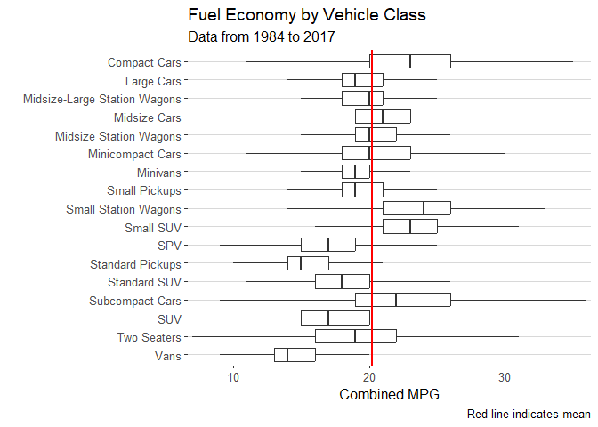
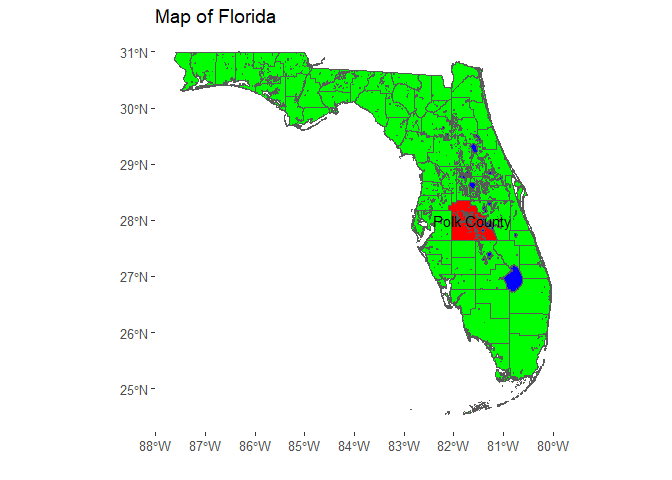
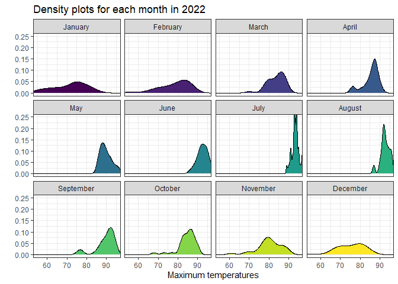

# Data Visualization and Reproducible Research

> Ethan Cooper

The following is a sample of products created during the _"Data Visualization and Reproducible Research"_ course.

## Project 01

In the `project_01/` folder you can find two graphs looking at fuel economy and three showing the proportion of vehicle classes overall, and for two selected fuel types.

**Fuel economy by vehicle class:** 

## Project 02

In this project, I explored two ways of looking at weather data in Atlanta and created a map of Florida as an example of importing shapefiles. Find the code and report in the `project_02/` folder.

**Map of Florida:** 

## Project 03

In this project, I recreated different plots using the knowledge that I've learned throughout this course.

**Temperature density plots:** 

### Moving Forward

Recreating plots that already exist is no longer a challenge, but I've ran into time constraints and a lack of direction when creating my own. I would like to find ways to collect data relevant to my own life or things that I do and use that information to create my own visuals. I have also learned that there can be many approaches to creating a specific graph. Finding a consistent way to organize graphs I create and practicing with each of these approaches may help if I ever need to write a report containing many visuals.
