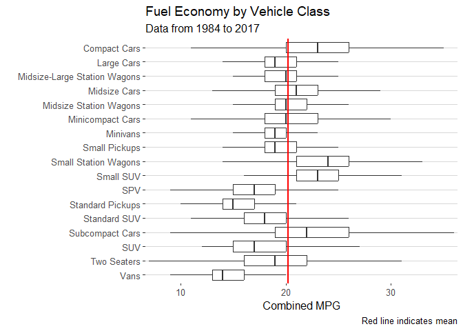
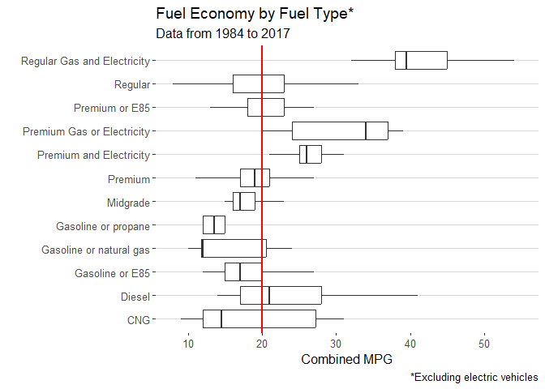
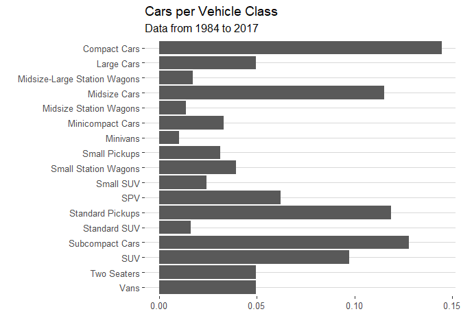
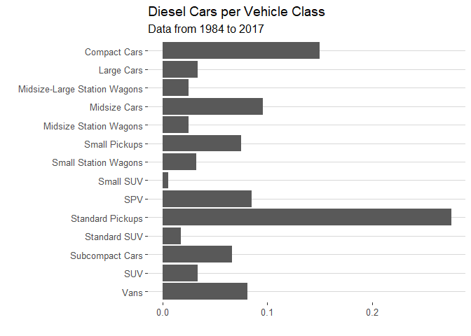
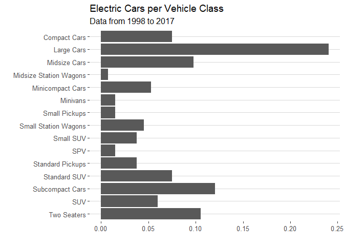

# Data Visualization Project 01


``` r
library(ggthemes)
library(tidyverse)
```


``` r
fuel_raw <- read_csv("../data/fuel.csv", col_types = cols())
```

Vehicle classes are merged to eliminate duplicated classes and simplify the data set. 2WD and 4WD differences will not be explored and do not need to be preserved.


``` r
fuel_by_class <- fuel_raw |>
  mutate(fuel_type = recode(fuel_type, "Regular Gas or Electricity" = "Regular Gas and Electricity")) |>
  mutate(class =
    recode(class,
           "Minivan - 2WD" = "Minivans",
           "Minivan - 4WD" = "Minivans",
           "Small Pickup Trucks" = "Small Pickups",
           "Small Pickup Trucks 2WD" = "Small Pickups",
           "Small Pickup Trucks 4WD" = "Small Pickups",
           "Small Sport Utility Vehicle 2WD" = "Small SUV",
           "Small Sport Utility Vehicle 4WD" = "Small SUV",
           "Special Purpose Vehicle" = "SPV",
           "Special Purpose Vehicles" = "SPV",
           "Special Purpose Vehicle 2WD" = "SPV",
           "Special Purpose Vehicles/2wd" = "SPV",
           "Special Purpose Vehicle 4WD" = "SPV",
           "Special Purpose Vehicles/4wd" = "SPV",
           "Sport Utility Vehicle 2WD" = "SUV",
           "Sport Utility Vehicle - 2WD" = "SUV",
           "Sport Utility Vehicle 4WD" = "SUV",
           "Sport Utility Vehicle - 4WD" = "SUV",
           "Standard Pickup Trucks" = "Standard Pickups",
           "Standard Pickup Trucks 2WD" = "Standard Pickups",
           "Standard Pickup Trucks/2wd" = "Standard Pickups",
           "Standard Pickup Trucks 4WD" = "Standard Pickups",
           "Standard Sport Utility Vehicle 2WD" = "Standard SUV",
           "Standard Sport Utility Vehicle 4WD" = "Standard SUV",
           "Vans, Cargo Type" = "Vans",
           "Vans, Passenger Type" = "Vans",
           "Vans Passenger" = "Vans")) |>
 arrange(class) |>
  mutate(class = factor(class, levels = rev(sort(unique(class)))))

fuel_no_electric <- fuel_by_class |>
  filter(fuel_type != "Electricity")
fuel_only_diesel <- fuel_no_electric |>
  filter(fuel_type == "Diesel")
fuel_only_electric <- fuel_by_class |>
  filter(fuel_type == "Electricity")
```

Pickups, vans, and SUVs tend to have below average fuel economy. Smaller vehicles are above average. Compact and subcompact cars both have a very large range, with some cars being far below the average. These categories should be explored further or subdivided.


``` r
ggplot(fuel_by_class,
       aes(x = combined_mpg_ft1,
           y = class)) +
  coord_cartesian(x = c(8, 35)) +
  geom_boxplot(outliers = FALSE) +
  geom_vline(xintercept = mean(fuel_by_class$combined_mpg_ft1),
             color = "red",
             linewidth = 1) +
  labs(title = "Fuel Economy by Vehicle Class",
       subtitle = "Data from 1984 to 2017",
       caption = "Red line indicates mean",
       x = "Combined MPG",
       y = "") +
  theme_hc()
```

<!-- -->

Hybrids and electric cars have very good fuel economy. Diesel vehicles also tend to be above average. Most CNG vehicles are far below average, although there are plenty of vehicles that are above average too.


``` r
ggplot(fuel_no_electric,
       aes(x = combined_mpg_ft1,
           y = fuel_type)) +
  coord_cartesian(x = c(8, 55)) +
  geom_boxplot(outliers = FALSE) +
  geom_vline(xintercept = mean(fuel_no_electric$combined_mpg_ft1),
             color = "red",
             linewidth = 1) +
  labs(title = "Fuel Economy by Fuel Type*",
       subtitle = "Data from 1984 to 2017",
       caption = "*Excluding electric vehicles",
       x = "Combined MPG",
       y = "") +
  theme_hc()
```

<!-- -->

Minivans and station wagons are not very common. Yearly trends in the proportion of each vehicle class should also be explored.


``` r
ggplot(fuel_by_class,
       aes(y = class)) +
  geom_bar(aes(x = after_stat(count) / sum(after_stat(count)))) +
  labs(title = "Cars per Vehicle Class",
       subtitle = "Data from 1984 to 2017",
       x = "",
       y = "") +
  theme_hc()
```

<!-- -->

Diesel is very popular for pickup trucks and small cars.


``` r
ggplot(fuel_only_diesel,
       aes(y = class)) +
  geom_bar(aes(x = after_stat(count) / sum(after_stat(count)))) +
  labs(title = "Diesel Cars per Vehicle Class",
       subtitle = "Data from 1984 to 2017",
       x = "",
       y = "") +
  theme_hc()
```

<!-- -->

Almost all electric vehicles are cars or SUVs.


``` r
ggplot(fuel_only_electric,
       aes(y = class)) +
  geom_bar(aes(x = after_stat(count) / sum(after_stat(count)))) +
  labs(title = "Electric Cars per Vehicle Class",
       subtitle = "Data from 1998 to 2017",
       x = "",
       y = "") +
  theme_hc()
```

<!-- -->
