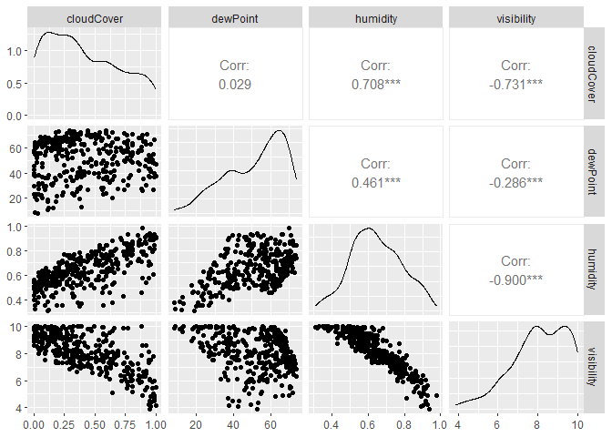
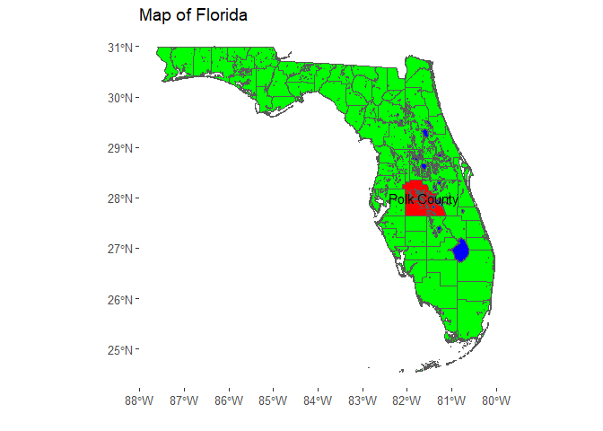

# Data Visualization Project 02


``` r
library(GGally)
library(ggthemes)
library(plotly)
library(sf)
library(tidyverse)
```


``` r
weather_raw <- read_csv("../data/atl-weather.csv")
```

```
## Rows: 365 Columns: 40
## ── Column specification ────────────────────────────────────────────────────────
## Delimiter: ","
## chr   (3): summary, icon, precipType
## dbl  (29): moonPhase, precipIntensity, precipIntensityMax, precipProbability...
## dttm  (8): time, sunriseTime, sunsetTime, precipIntensityMaxTime, temperatur...
## 
## ℹ Use `spec()` to retrieve the full column specification for this data.
## ℹ Specify the column types or set `show_col_types = FALSE` to quiet this message.
```


``` r
weather_temps <- weather_raw |>
  pivot_longer(cols = c(temperatureLow,
                        temperatureHigh),
               names_to = "temperatureType",
               values_to = "temperature")
```

The raw data is shown with a thin line in the background. The thicker lines show a smoothed version of the data, which makes it much easier to view the average temperature throughout the year.


``` r
temps_plot <- ggplot(weather_temps,
                     aes(x = time,
                         y = temperature,
                         color = temperatureType)) +
  geom_line(linewidth = 0.1) +
  geom_smooth(se = FALSE) +
  guides(color = "none") +
  labs(title = "Daily high and low temperatures in Atlanta",
       subtitle = "January 1, 2019 - January 1, 2020",
       x = NULL,
       y = "Fahrenheit") +
  theme_hc()

ggplotly(temps_plot)
```

```
## `geom_smooth()` using method = 'loess' and formula = 'y ~ x'
```

```{=html}
<div class="plotly html-widget html-fill-item" id="htmlwidget-7bcae452626853803f14" style="width:672px;height:480px;"></div>
<script type="application/json" data-for="htmlwidget-7bcae452626853803f14">{"x":{"data":[{"x":[1546318800,1546405200,1546491600,1546578000,1546664400,1546750800,1546837200,1546923600,1547010000,1547096400,1547182800,1547269200,1547355600,1547442000,1547528400,1547614800,1547701200,1547787600,1547874000,1547960400,1548046800,1548133200,1548219600,1548306000,1548392400,1548478800,1548565200,1548651600,1548738000,1548824400,1548910800,1548997200,1549083600,1549170000,1549256400,1549342800,1549429200,1549515600,1549602000,1549688400,1549774800,1549861200,1549947600,1550034000,1550120400,1550206800,1550293200,1550379600,1550466000,1550552400,1550638800,1550725200,1550811600,1550898000,1550984400,1551070800,1551157200,1551243600,1551330000,1551416400,1551502800,1551589200,1551675600,1551762000,1551848400,1551934800,1552021200,1552107600,1552194000,1552276800,1552363200,1552449600,1552536000,1552622400,1552708800,1552795200,1552881600,1552968000,1553054400,1553140800,1553227200,1553313600,1553400000,1553486400,1553572800,1553659200,1553745600,1553832000,1553918400,1554004800,1554091200,1554177600,1554264000,1554350400,1554436800,1554523200,1554609600,1554696000,1554782400,1554868800,1554955200,1555041600,1555128000,1555214400,1555300800,1555387200,1555473600,1555560000,1555646400,1555732800,1555819200,1555905600,1555992000,1556078400,1556164800,1556251200,1556337600,1556424000,1556510400,1556596800,1556683200,1556769600,1556856000,1556942400,1557028800,1557115200,1557201600,1557288000,1557374400,1557460800,1557547200,1557633600,1557720000,1557806400,1557892800,1557979200,1558065600,1558152000,1558238400,1558324800,1558411200,1558497600,1558584000,1558670400,1558756800,1558843200,1558929600,1559016000,1559102400,1559188800,1559275200,1559361600,1559448000,1559534400,1559620800,1559707200,1559793600,1559880000,1559966400,1560052800,1560139200,1560225600,1560312000,1560398400,1560484800,1560571200,1560657600,1560744000,1560830400,1560916800,1561003200,1561089600,1561176000,1561262400,1561348800,1561435200,1561521600,1561608000,1561694400,1561780800,1561867200,1561953600,1562040000,1562126400,1562212800,1562299200,1562385600,1562472000,1562558400,1562644800,1562731200,1562817600,1562904000,1562990400,1563076800,1563163200,1563249600,1563336000,1563422400,1563508800,1563595200,1563681600,1563768000,1563854400,1563940800,1564027200,1564113600,1564200000,1564286400,1564372800,1564459200,1564545600,1564632000,1564718400,1564804800,1564891200,1564977600,1565064000,1565150400,1565236800,1565323200,1565409600,1565496000,1565582400,1565668800,1565755200,1565841600,1565928000,1566014400,1566100800,1566187200,1566273600,1566360000,1566446400,1566532800,1566619200,1566705600,1566792000,1566878400,1566964800,1567051200,1567137600,1567224000,1567310400,1567396800,1567483200,1567569600,1567656000,1567742400,1567828800,1567915200,1568001600,1568088000,1568174400,1568260800,1568347200,1568433600,1568520000,1568606400,1568692800,1568779200,1568865600,1568952000,1569038400,1569124800,1569211200,1569297600,1569384000,1569470400,1569556800,1569643200,1569729600,1569816000,1569902400,1569988800,1570075200,1570161600,1570248000,1570334400,1570420800,1570507200,1570593600,1570680000,1570766400,1570852800,1570939200,1571025600,1571112000,1571198400,1571284800,1571371200,1571457600,1571544000,1571630400,1571716800,1571803200,1571889600,1571976000,1572062400,1572148800,1572235200,1572321600,1572408000,1572494400,1572580800,1572667200,1572753600,1572843600,1572930000,1573016400,1573102800,1573189200,1573275600,1573362000,1573448400,1573534800,1573621200,1573707600,1573794000,1573880400,1573966800,1574053200,1574139600,1574226000,1574312400,1574398800,1574485200,1574571600,1574658000,1574744400,1574830800,1574917200,1575003600,1575090000,1575176400,1575262800,1575349200,1575435600,1575522000,1575608400,1575694800,1575781200,1575867600,1575954000,1576040400,1576126800,1576213200,1576299600,1576386000,1576472400,1576558800,1576645200,1576731600,1576818000,1576904400,1576990800,1577077200,1577163600,1577250000,1577336400,1577422800,1577509200,1577595600,1577682000,1577768400],"y":[50.579999999999998,49.030000000000001,53.079999999999998,42.950000000000003,42.520000000000003,42,47.240000000000002,41.899999999999999,28.899999999999999,28.91,39.909999999999997,35.200000000000003,41.280000000000001,34.25,30.199999999999999,31.690000000000001,44.719999999999999,47.43,32.159999999999997,22.190000000000001,29.920000000000002,40.850000000000001,40.549999999999997,31.43,27.620000000000001,31.43,31.260000000000002,45.640000000000001,23.890000000000001,27.59,29.879999999999999,35.82,51.640000000000001,41.359999999999999,54.560000000000002,55.32,61.880000000000003,51.57,38.399999999999999,40.659999999999997,37.170000000000002,50.469999999999999,36.979999999999997,33.119999999999997,49.880000000000003,54.259999999999998,47.630000000000003,45.5,43.049999999999997,37.619999999999997,42.189999999999998,53.490000000000002,47.189999999999998,47.340000000000003,39.170000000000002,41.75,54.469999999999999,54.060000000000002,58.439999999999998,50.020000000000003,51.890000000000001,35.979999999999997,26.920000000000002,26.949999999999999,29.420000000000002,47.640000000000001,48.68,54.57,54.509999999999998,45.950000000000003,51.490000000000002,55.829999999999998,64.359999999999999,42.25,40.189999999999998,41.18,35.479999999999997,35.979999999999997,42.5,40.030000000000001,41.530000000000001,42.810000000000002,51.810000000000002,49.530000000000001,46.689999999999998,38.009999999999998,44.829999999999998,52.469999999999999,45.780000000000001,36.57,44.619999999999997,39.850000000000001,45.82,55.07,57.93,60.600000000000001,63.25,63.299999999999997,56.289999999999999,59.049999999999997,66.459999999999994,58.719999999999999,67.409999999999997,44.829999999999998,44.729999999999997,50.890000000000001,61.630000000000003,61.82,42.810000000000002,43.560000000000002,46.240000000000002,53.340000000000003,58.579999999999998,60.060000000000002,59.420000000000002,48.25,57.859999999999999,61.100000000000001,60.490000000000002,65.920000000000002,65.090000000000003,64.459999999999994,67.069999999999993,64.870000000000005,57.25,59.420000000000002,64.25,65.599999999999994,64.390000000000001,67.060000000000002,64.599999999999994,61.57,51.549999999999997,51.219999999999999,60.380000000000003,64.099999999999994,64.989999999999995,66.340000000000003,67.819999999999993,64.680000000000007,70.239999999999995,70.489999999999995,69.629999999999995,71.400000000000006,69.739999999999995,70.010000000000005,70.859999999999999,69.189999999999998,73.200000000000003,72.230000000000004,64.700000000000003,65.640000000000001,67.780000000000001,69.359999999999999,68.510000000000005,72.409999999999997,69.129999999999995,69.290000000000006,69.049999999999997,71.409999999999997,65.819999999999993,65.549999999999997,64.519999999999996,56.170000000000002,60.020000000000003,65.780000000000001,69.310000000000002,72.280000000000001,69.859999999999999,72.939999999999998,70.260000000000005,70.560000000000002,68.620000000000005,70.799999999999997,68.620000000000005,69,70.549999999999997,70.370000000000005,69.969999999999999,71.519999999999996,73.489999999999995,74.489999999999995,77.150000000000006,76.25,73.819999999999993,72.420000000000002,74.909999999999997,73.439999999999998,76.280000000000001,75.599999999999994,74.969999999999999,75.129999999999995,73.909999999999997,73.069999999999993,72.489999999999995,73.099999999999994,75.489999999999995,73.870000000000005,75.769999999999996,72.569999999999993,71.019999999999996,73.569999999999993,73.25,66.409999999999997,63.899999999999999,65.010000000000005,66.370000000000005,67.879999999999995,70.489999999999995,69.260000000000005,71.530000000000001,70.260000000000005,69.099999999999994,70.140000000000001,71.060000000000002,72.439999999999998,71.459999999999994,73.170000000000002,74.040000000000006,74.379999999999995,75.560000000000002,76.75,77.260000000000005,79.299999999999997,74.530000000000001,74.120000000000005,72.209999999999994,73.680000000000007,74.609999999999999,75.200000000000003,72.370000000000005,72.079999999999998,74.920000000000002,76.459999999999994,73.799999999999997,66.609999999999999,67.599999999999994,70.640000000000001,70.370000000000005,67.180000000000007,67.810000000000002,67.439999999999998,71.829999999999998,70.75,73,73.840000000000003,75.810000000000002,68.659999999999997,72.760000000000005,70.890000000000001,72.519999999999996,76.180000000000007,73.400000000000006,73.950000000000003,74.420000000000002,71.700000000000003,71.209999999999994,74.099999999999994,73.549999999999997,73.340000000000003,68.890000000000001,62.210000000000001,63.810000000000002,62.5,64.129999999999995,72.549999999999997,66.150000000000006,74.170000000000002,74,73.640000000000001,72.510000000000005,73.200000000000003,73.569999999999993,75.200000000000003,75.329999999999998,74.680000000000007,74.239999999999995,60.93,66.409999999999997,64.930000000000007,64.150000000000006,61.920000000000002,60.369999999999997,62.420000000000002,62.289999999999999,53.109999999999999,65.209999999999994,62.159999999999997,45.68,46.859999999999999,54.770000000000003,52.909999999999997,57.799999999999997,58.130000000000003,46.810000000000002,47.770000000000003,60.810000000000002,65.599999999999994,57.670000000000002,50.630000000000003,58.520000000000003,64.939999999999998,71.170000000000002,34.649999999999999,37.640000000000001,38.850000000000001,41.270000000000003,53.990000000000002,47.539999999999999,56.630000000000003,44.640000000000001,36.060000000000002,38.409999999999997,43.350000000000001,38.130000000000003,23.699999999999999,34.039999999999999,41.07,40.130000000000003,46.18,49.780000000000001,43.869999999999997,45.710000000000001,43.899999999999999,49.850000000000001,59.649999999999999,42.990000000000002,38.159999999999997,39.18,56.439999999999998,44.420000000000002,49.799999999999997,53.399999999999999,59.020000000000003,40.93,35.32,36.380000000000003,42.810000000000002,46.219999999999999,50.18,46.219999999999999,46.880000000000003,52.960000000000001,35.079999999999998,35.369999999999997,36.609999999999999,42.659999999999997,43.450000000000003,53.990000000000002,60.560000000000002,31.170000000000002,30.030000000000001,34.32,44.939999999999998,40.399999999999999,41.729999999999997,53.649999999999999,47,42.689999999999998,53.189999999999998,55.420000000000002,60.759999999999998,52.030000000000001,39.32,38.049999999999997],"text":["time: 2019-01-01 05:00:00<br />temperature: 50.58<br />temperatureType: temperatureLow","time: 2019-01-02 05:00:00<br />temperature: 49.03<br />temperatureType: temperatureLow","time: 2019-01-03 05:00:00<br />temperature: 53.08<br />temperatureType: temperatureLow","time: 2019-01-04 05:00:00<br />temperature: 42.95<br />temperatureType: temperatureLow","time: 2019-01-05 05:00:00<br />temperature: 42.52<br />temperatureType: temperatureLow","time: 2019-01-06 05:00:00<br />temperature: 42.00<br />temperatureType: temperatureLow","time: 2019-01-07 05:00:00<br />temperature: 47.24<br />temperatureType: temperatureLow","time: 2019-01-08 05:00:00<br />temperature: 41.90<br />temperatureType: temperatureLow","time: 2019-01-09 05:00:00<br />temperature: 28.90<br />temperatureType: temperatureLow","time: 2019-01-10 05:00:00<br />temperature: 28.91<br />temperatureType: temperatureLow","time: 2019-01-11 05:00:00<br />temperature: 39.91<br />temperatureType: temperatureLow","time: 2019-01-12 05:00:00<br />temperature: 35.20<br />temperatureType: temperatureLow","time: 2019-01-13 05:00:00<br />temperature: 41.28<br />temperatureType: temperatureLow","time: 2019-01-14 05:00:00<br />temperature: 34.25<br />temperatureType: temperatureLow","time: 2019-01-15 05:00:00<br />temperature: 30.20<br />temperatureType: temperatureLow","time: 2019-01-16 05:00:00<br />temperature: 31.69<br />temperatureType: temperatureLow","time: 2019-01-17 05:00:00<br />temperature: 44.72<br />temperatureType: temperatureLow","time: 2019-01-18 05:00:00<br />temperature: 47.43<br />temperatureType: temperatureLow","time: 2019-01-19 05:00:00<br />temperature: 32.16<br />temperatureType: temperatureLow","time: 2019-01-20 05:00:00<br />temperature: 22.19<br />temperatureType: temperatureLow","time: 2019-01-21 05:00:00<br />temperature: 29.92<br />temperatureType: temperatureLow","time: 2019-01-22 05:00:00<br />temperature: 40.85<br />temperatureType: temperatureLow","time: 2019-01-23 05:00:00<br />temperature: 40.55<br />temperatureType: temperatureLow","time: 2019-01-24 05:00:00<br />temperature: 31.43<br />temperatureType: temperatureLow","time: 2019-01-25 05:00:00<br />temperature: 27.62<br />temperatureType: temperatureLow","time: 2019-01-26 05:00:00<br />temperature: 31.43<br />temperatureType: temperatureLow","time: 2019-01-27 05:00:00<br />temperature: 31.26<br />temperatureType: temperatureLow","time: 2019-01-28 05:00:00<br />temperature: 45.64<br />temperatureType: temperatureLow","time: 2019-01-29 05:00:00<br />temperature: 23.89<br />temperatureType: temperatureLow","time: 2019-01-30 05:00:00<br />temperature: 27.59<br />temperatureType: temperatureLow","time: 2019-01-31 05:00:00<br />temperature: 29.88<br />temperatureType: temperatureLow","time: 2019-02-01 05:00:00<br />temperature: 35.82<br />temperatureType: temperatureLow","time: 2019-02-02 05:00:00<br />temperature: 51.64<br />temperatureType: temperatureLow","time: 2019-02-03 05:00:00<br />temperature: 41.36<br />temperatureType: temperatureLow","time: 2019-02-04 05:00:00<br />temperature: 54.56<br />temperatureType: temperatureLow","time: 2019-02-05 05:00:00<br />temperature: 55.32<br />temperatureType: temperatureLow","time: 2019-02-06 05:00:00<br />temperature: 61.88<br />temperatureType: temperatureLow","time: 2019-02-07 05:00:00<br />temperature: 51.57<br />temperatureType: temperatureLow","time: 2019-02-08 05:00:00<br />temperature: 38.40<br />temperatureType: temperatureLow","time: 2019-02-09 05:00:00<br />temperature: 40.66<br />temperatureType: temperatureLow","time: 2019-02-10 05:00:00<br />temperature: 37.17<br />temperatureType: temperatureLow","time: 2019-02-11 05:00:00<br />temperature: 50.47<br />temperatureType: temperatureLow","time: 2019-02-12 05:00:00<br />temperature: 36.98<br />temperatureType: temperatureLow","time: 2019-02-13 05:00:00<br />temperature: 33.12<br />temperatureType: temperatureLow","time: 2019-02-14 05:00:00<br />temperature: 49.88<br />temperatureType: temperatureLow","time: 2019-02-15 05:00:00<br />temperature: 54.26<br />temperatureType: temperatureLow","time: 2019-02-16 05:00:00<br />temperature: 47.63<br />temperatureType: temperatureLow","time: 2019-02-17 05:00:00<br />temperature: 45.50<br />temperatureType: temperatureLow","time: 2019-02-18 05:00:00<br />temperature: 43.05<br />temperatureType: temperatureLow","time: 2019-02-19 05:00:00<br />temperature: 37.62<br />temperatureType: temperatureLow","time: 2019-02-20 05:00:00<br />temperature: 42.19<br />temperatureType: temperatureLow","time: 2019-02-21 05:00:00<br />temperature: 53.49<br />temperatureType: temperatureLow","time: 2019-02-22 05:00:00<br />temperature: 47.19<br />temperatureType: temperatureLow","time: 2019-02-23 05:00:00<br />temperature: 47.34<br />temperatureType: temperatureLow","time: 2019-02-24 05:00:00<br />temperature: 39.17<br />temperatureType: temperatureLow","time: 2019-02-25 05:00:00<br />temperature: 41.75<br />temperatureType: temperatureLow","time: 2019-02-26 05:00:00<br />temperature: 54.47<br />temperatureType: temperatureLow","time: 2019-02-27 05:00:00<br />temperature: 54.06<br />temperatureType: temperatureLow","time: 2019-02-28 05:00:00<br />temperature: 58.44<br />temperatureType: temperatureLow","time: 2019-03-01 05:00:00<br />temperature: 50.02<br />temperatureType: temperatureLow","time: 2019-03-02 05:00:00<br />temperature: 51.89<br />temperatureType: temperatureLow","time: 2019-03-03 05:00:00<br />temperature: 35.98<br />temperatureType: temperatureLow","time: 2019-03-04 05:00:00<br />temperature: 26.92<br />temperatureType: temperatureLow","time: 2019-03-05 05:00:00<br />temperature: 26.95<br />temperatureType: temperatureLow","time: 2019-03-06 05:00:00<br />temperature: 29.42<br />temperatureType: temperatureLow","time: 2019-03-07 05:00:00<br />temperature: 47.64<br />temperatureType: temperatureLow","time: 2019-03-08 05:00:00<br />temperature: 48.68<br />temperatureType: temperatureLow","time: 2019-03-09 05:00:00<br />temperature: 54.57<br />temperatureType: temperatureLow","time: 2019-03-10 05:00:00<br />temperature: 54.51<br />temperatureType: temperatureLow","time: 2019-03-11 04:00:00<br />temperature: 45.95<br />temperatureType: temperatureLow","time: 2019-03-12 04:00:00<br />temperature: 51.49<br />temperatureType: temperatureLow","time: 2019-03-13 04:00:00<br />temperature: 55.83<br />temperatureType: temperatureLow","time: 2019-03-14 04:00:00<br />temperature: 64.36<br />temperatureType: temperatureLow","time: 2019-03-15 04:00:00<br />temperature: 42.25<br />temperatureType: temperatureLow","time: 2019-03-16 04:00:00<br />temperature: 40.19<br />temperatureType: temperatureLow","time: 2019-03-17 04:00:00<br />temperature: 41.18<br />temperatureType: temperatureLow","time: 2019-03-18 04:00:00<br />temperature: 35.48<br />temperatureType: temperatureLow","time: 2019-03-19 04:00:00<br />temperature: 35.98<br />temperatureType: temperatureLow","time: 2019-03-20 04:00:00<br />temperature: 42.50<br />temperatureType: temperatureLow","time: 2019-03-21 04:00:00<br />temperature: 40.03<br />temperatureType: temperatureLow","time: 2019-03-22 04:00:00<br />temperature: 41.53<br />temperatureType: temperatureLow","time: 2019-03-23 04:00:00<br />temperature: 42.81<br />temperatureType: temperatureLow","time: 2019-03-24 04:00:00<br />temperature: 51.81<br />temperatureType: temperatureLow","time: 2019-03-25 04:00:00<br />temperature: 49.53<br />temperatureType: temperatureLow","time: 2019-03-26 04:00:00<br />temperature: 46.69<br />temperatureType: temperatureLow","time: 2019-03-27 04:00:00<br />temperature: 38.01<br />temperatureType: temperatureLow","time: 2019-03-28 04:00:00<br />temperature: 44.83<br />temperatureType: temperatureLow","time: 2019-03-29 04:00:00<br />temperature: 52.47<br />temperatureType: temperatureLow","time: 2019-03-30 04:00:00<br />temperature: 45.78<br />temperatureType: temperatureLow","time: 2019-03-31 04:00:00<br />temperature: 36.57<br />temperatureType: temperatureLow","time: 2019-04-01 04:00:00<br />temperature: 44.62<br />temperatureType: temperatureLow","time: 2019-04-02 04:00:00<br />temperature: 39.85<br />temperatureType: temperatureLow","time: 2019-04-03 04:00:00<br />temperature: 45.82<br />temperatureType: temperatureLow","time: 2019-04-04 04:00:00<br />temperature: 55.07<br />temperatureType: temperatureLow","time: 2019-04-05 04:00:00<br />temperature: 57.93<br />temperatureType: temperatureLow","time: 2019-04-06 04:00:00<br />temperature: 60.60<br />temperatureType: temperatureLow","time: 2019-04-07 04:00:00<br />temperature: 63.25<br />temperatureType: temperatureLow","time: 2019-04-08 04:00:00<br />temperature: 63.30<br />temperatureType: temperatureLow","time: 2019-04-09 04:00:00<br />temperature: 56.29<br />temperatureType: temperatureLow","time: 2019-04-10 04:00:00<br />temperature: 59.05<br />temperatureType: temperatureLow","time: 2019-04-11 04:00:00<br />temperature: 66.46<br />temperatureType: temperatureLow","time: 2019-04-12 04:00:00<br />temperature: 58.72<br />temperatureType: temperatureLow","time: 2019-04-13 04:00:00<br />temperature: 67.41<br />temperatureType: temperatureLow","time: 2019-04-14 04:00:00<br />temperature: 44.83<br />temperatureType: temperatureLow","time: 2019-04-15 04:00:00<br />temperature: 44.73<br />temperatureType: temperatureLow","time: 2019-04-16 04:00:00<br />temperature: 50.89<br />temperatureType: temperatureLow","time: 2019-04-17 04:00:00<br />temperature: 61.63<br />temperatureType: temperatureLow","time: 2019-04-18 04:00:00<br />temperature: 61.82<br />temperatureType: temperatureLow","time: 2019-04-19 04:00:00<br />temperature: 42.81<br />temperatureType: temperatureLow","time: 2019-04-20 04:00:00<br />temperature: 43.56<br />temperatureType: temperatureLow","time: 2019-04-21 04:00:00<br />temperature: 46.24<br />temperatureType: temperatureLow","time: 2019-04-22 04:00:00<br />temperature: 53.34<br />temperatureType: temperatureLow","time: 2019-04-23 04:00:00<br />temperature: 58.58<br />temperatureType: temperatureLow","time: 2019-04-24 04:00:00<br />temperature: 60.06<br />temperatureType: temperatureLow","time: 2019-04-25 04:00:00<br />temperature: 59.42<br />temperatureType: temperatureLow","time: 2019-04-26 04:00:00<br />temperature: 48.25<br />temperatureType: temperatureLow","time: 2019-04-27 04:00:00<br />temperature: 57.86<br />temperatureType: temperatureLow","time: 2019-04-28 04:00:00<br />temperature: 61.10<br />temperatureType: temperatureLow","time: 2019-04-29 04:00:00<br />temperature: 60.49<br />temperatureType: temperatureLow","time: 2019-04-30 04:00:00<br />temperature: 65.92<br />temperatureType: temperatureLow","time: 2019-05-01 04:00:00<br />temperature: 65.09<br />temperatureType: temperatureLow","time: 2019-05-02 04:00:00<br />temperature: 64.46<br />temperatureType: temperatureLow","time: 2019-05-03 04:00:00<br />temperature: 67.07<br />temperatureType: temperatureLow","time: 2019-05-04 04:00:00<br />temperature: 64.87<br />temperatureType: temperatureLow","time: 2019-05-05 04:00:00<br />temperature: 57.25<br />temperatureType: temperatureLow","time: 2019-05-06 04:00:00<br />temperature: 59.42<br />temperatureType: temperatureLow","time: 2019-05-07 04:00:00<br />temperature: 64.25<br />temperatureType: temperatureLow","time: 2019-05-08 04:00:00<br />temperature: 65.60<br />temperatureType: temperatureLow","time: 2019-05-09 04:00:00<br />temperature: 64.39<br />temperatureType: temperatureLow","time: 2019-05-10 04:00:00<br />temperature: 67.06<br />temperatureType: temperatureLow","time: 2019-05-11 04:00:00<br />temperature: 64.60<br />temperatureType: temperatureLow","time: 2019-05-12 04:00:00<br />temperature: 61.57<br />temperatureType: temperatureLow","time: 2019-05-13 04:00:00<br />temperature: 51.55<br />temperatureType: temperatureLow","time: 2019-05-14 04:00:00<br />temperature: 51.22<br />temperatureType: temperatureLow","time: 2019-05-15 04:00:00<br />temperature: 60.38<br />temperatureType: temperatureLow","time: 2019-05-16 04:00:00<br />temperature: 64.10<br />temperatureType: temperatureLow","time: 2019-05-17 04:00:00<br />temperature: 64.99<br />temperatureType: temperatureLow","time: 2019-05-18 04:00:00<br />temperature: 66.34<br />temperatureType: temperatureLow","time: 2019-05-19 04:00:00<br />temperature: 67.82<br />temperatureType: temperatureLow","time: 2019-05-20 04:00:00<br />temperature: 64.68<br />temperatureType: temperatureLow","time: 2019-05-21 04:00:00<br />temperature: 70.24<br />temperatureType: temperatureLow","time: 2019-05-22 04:00:00<br />temperature: 70.49<br />temperatureType: temperatureLow","time: 2019-05-23 04:00:00<br />temperature: 69.63<br />temperatureType: temperatureLow","time: 2019-05-24 04:00:00<br />temperature: 71.40<br />temperatureType: temperatureLow","time: 2019-05-25 04:00:00<br />temperature: 69.74<br />temperatureType: temperatureLow","time: 2019-05-26 04:00:00<br />temperature: 70.01<br />temperatureType: temperatureLow","time: 2019-05-27 04:00:00<br />temperature: 70.86<br />temperatureType: temperatureLow","time: 2019-05-28 04:00:00<br />temperature: 69.19<br />temperatureType: temperatureLow","time: 2019-05-29 04:00:00<br />temperature: 73.20<br />temperatureType: temperatureLow","time: 2019-05-30 04:00:00<br />temperature: 72.23<br />temperatureType: temperatureLow","time: 2019-05-31 04:00:00<br />temperature: 64.70<br />temperatureType: temperatureLow","time: 2019-06-01 04:00:00<br />temperature: 65.64<br />temperatureType: temperatureLow","time: 2019-06-02 04:00:00<br />temperature: 67.78<br />temperatureType: temperatureLow","time: 2019-06-03 04:00:00<br />temperature: 69.36<br />temperatureType: temperatureLow","time: 2019-06-04 04:00:00<br />temperature: 68.51<br />temperatureType: temperatureLow","time: 2019-06-05 04:00:00<br />temperature: 72.41<br />temperatureType: temperatureLow","time: 2019-06-06 04:00:00<br />temperature: 69.13<br />temperatureType: temperatureLow","time: 2019-06-07 04:00:00<br />temperature: 69.29<br />temperatureType: temperatureLow","time: 2019-06-08 04:00:00<br />temperature: 69.05<br />temperatureType: temperatureLow","time: 2019-06-09 04:00:00<br />temperature: 71.41<br />temperatureType: temperatureLow","time: 2019-06-10 04:00:00<br />temperature: 65.82<br />temperatureType: temperatureLow","time: 2019-06-11 04:00:00<br />temperature: 65.55<br />temperatureType: temperatureLow","time: 2019-06-12 04:00:00<br />temperature: 64.52<br />temperatureType: temperatureLow","time: 2019-06-13 04:00:00<br />temperature: 56.17<br />temperatureType: temperatureLow","time: 2019-06-14 04:00:00<br />temperature: 60.02<br />temperatureType: temperatureLow","time: 2019-06-15 04:00:00<br />temperature: 65.78<br />temperatureType: temperatureLow","time: 2019-06-16 04:00:00<br />temperature: 69.31<br />temperatureType: temperatureLow","time: 2019-06-17 04:00:00<br />temperature: 72.28<br />temperatureType: temperatureLow","time: 2019-06-18 04:00:00<br />temperature: 69.86<br />temperatureType: temperatureLow","time: 2019-06-19 04:00:00<br />temperature: 72.94<br />temperatureType: temperatureLow","time: 2019-06-20 04:00:00<br />temperature: 70.26<br />temperatureType: temperatureLow","time: 2019-06-21 04:00:00<br />temperature: 70.56<br />temperatureType: temperatureLow","time: 2019-06-22 04:00:00<br />temperature: 68.62<br />temperatureType: temperatureLow","time: 2019-06-23 04:00:00<br />temperature: 70.80<br />temperatureType: temperatureLow","time: 2019-06-24 04:00:00<br />temperature: 68.62<br />temperatureType: temperatureLow","time: 2019-06-25 04:00:00<br />temperature: 69.00<br />temperatureType: temperatureLow","time: 2019-06-26 04:00:00<br />temperature: 70.55<br />temperatureType: temperatureLow","time: 2019-06-27 04:00:00<br />temperature: 70.37<br />temperatureType: temperatureLow","time: 2019-06-28 04:00:00<br />temperature: 69.97<br />temperatureType: temperatureLow","time: 2019-06-29 04:00:00<br />temperature: 71.52<br />temperatureType: temperatureLow","time: 2019-06-30 04:00:00<br />temperature: 73.49<br />temperatureType: temperatureLow","time: 2019-07-01 04:00:00<br />temperature: 74.49<br />temperatureType: temperatureLow","time: 2019-07-02 04:00:00<br />temperature: 77.15<br />temperatureType: temperatureLow","time: 2019-07-03 04:00:00<br />temperature: 76.25<br />temperatureType: temperatureLow","time: 2019-07-04 04:00:00<br />temperature: 73.82<br />temperatureType: temperatureLow","time: 2019-07-05 04:00:00<br />temperature: 72.42<br />temperatureType: temperatureLow","time: 2019-07-06 04:00:00<br />temperature: 74.91<br />temperatureType: temperatureLow","time: 2019-07-07 04:00:00<br />temperature: 73.44<br />temperatureType: temperatureLow","time: 2019-07-08 04:00:00<br />temperature: 76.28<br />temperatureType: temperatureLow","time: 2019-07-09 04:00:00<br />temperature: 75.60<br />temperatureType: temperatureLow","time: 2019-07-10 04:00:00<br />temperature: 74.97<br />temperatureType: temperatureLow","time: 2019-07-11 04:00:00<br />temperature: 75.13<br />temperatureType: temperatureLow","time: 2019-07-12 04:00:00<br />temperature: 73.91<br />temperatureType: temperatureLow","time: 2019-07-13 04:00:00<br />temperature: 73.07<br />temperatureType: temperatureLow","time: 2019-07-14 04:00:00<br />temperature: 72.49<br />temperatureType: temperatureLow","time: 2019-07-15 04:00:00<br />temperature: 73.10<br />temperatureType: temperatureLow","time: 2019-07-16 04:00:00<br />temperature: 75.49<br />temperatureType: temperatureLow","time: 2019-07-17 04:00:00<br />temperature: 73.87<br />temperatureType: temperatureLow","time: 2019-07-18 04:00:00<br />temperature: 75.77<br />temperatureType: temperatureLow","time: 2019-07-19 04:00:00<br />temperature: 72.57<br />temperatureType: temperatureLow","time: 2019-07-20 04:00:00<br />temperature: 71.02<br />temperatureType: temperatureLow","time: 2019-07-21 04:00:00<br />temperature: 73.57<br />temperatureType: temperatureLow","time: 2019-07-22 04:00:00<br />temperature: 73.25<br />temperatureType: temperatureLow","time: 2019-07-23 04:00:00<br />temperature: 66.41<br />temperatureType: temperatureLow","time: 2019-07-24 04:00:00<br />temperature: 63.90<br />temperatureType: temperatureLow","time: 2019-07-25 04:00:00<br />temperature: 65.01<br />temperatureType: temperatureLow","time: 2019-07-26 04:00:00<br />temperature: 66.37<br />temperatureType: temperatureLow","time: 2019-07-27 04:00:00<br />temperature: 67.88<br />temperatureType: temperatureLow","time: 2019-07-28 04:00:00<br />temperature: 70.49<br />temperatureType: temperatureLow","time: 2019-07-29 04:00:00<br />temperature: 69.26<br />temperatureType: temperatureLow","time: 2019-07-30 04:00:00<br />temperature: 71.53<br />temperatureType: temperatureLow","time: 2019-07-31 04:00:00<br />temperature: 70.26<br />temperatureType: temperatureLow","time: 2019-08-01 04:00:00<br />temperature: 69.10<br />temperatureType: temperatureLow","time: 2019-08-02 04:00:00<br />temperature: 70.14<br />temperatureType: temperatureLow","time: 2019-08-03 04:00:00<br />temperature: 71.06<br />temperatureType: temperatureLow","time: 2019-08-04 04:00:00<br />temperature: 72.44<br />temperatureType: temperatureLow","time: 2019-08-05 04:00:00<br />temperature: 71.46<br />temperatureType: temperatureLow","time: 2019-08-06 04:00:00<br />temperature: 73.17<br />temperatureType: temperatureLow","time: 2019-08-07 04:00:00<br />temperature: 74.04<br />temperatureType: temperatureLow","time: 2019-08-08 04:00:00<br />temperature: 74.38<br />temperatureType: temperatureLow","time: 2019-08-09 04:00:00<br />temperature: 75.56<br />temperatureType: temperatureLow","time: 2019-08-10 04:00:00<br />temperature: 76.75<br />temperatureType: temperatureLow","time: 2019-08-11 04:00:00<br />temperature: 77.26<br />temperatureType: temperatureLow","time: 2019-08-12 04:00:00<br />temperature: 79.30<br />temperatureType: temperatureLow","time: 2019-08-13 04:00:00<br />temperature: 74.53<br />temperatureType: temperatureLow","time: 2019-08-14 04:00:00<br />temperature: 74.12<br />temperatureType: temperatureLow","time: 2019-08-15 04:00:00<br />temperature: 72.21<br />temperatureType: temperatureLow","time: 2019-08-16 04:00:00<br />temperature: 73.68<br />temperatureType: temperatureLow","time: 2019-08-17 04:00:00<br />temperature: 74.61<br />temperatureType: temperatureLow","time: 2019-08-18 04:00:00<br />temperature: 75.20<br />temperatureType: temperatureLow","time: 2019-08-19 04:00:00<br />temperature: 72.37<br />temperatureType: temperatureLow","time: 2019-08-20 04:00:00<br />temperature: 72.08<br />temperatureType: temperatureLow","time: 2019-08-21 04:00:00<br />temperature: 74.92<br />temperatureType: temperatureLow","time: 2019-08-22 04:00:00<br />temperature: 76.46<br />temperatureType: temperatureLow","time: 2019-08-23 04:00:00<br />temperature: 73.80<br />temperatureType: temperatureLow","time: 2019-08-24 04:00:00<br />temperature: 66.61<br />temperatureType: temperatureLow","time: 2019-08-25 04:00:00<br />temperature: 67.60<br />temperatureType: temperatureLow","time: 2019-08-26 04:00:00<br />temperature: 70.64<br />temperatureType: temperatureLow","time: 2019-08-27 04:00:00<br />temperature: 70.37<br />temperatureType: temperatureLow","time: 2019-08-28 04:00:00<br />temperature: 67.18<br />temperatureType: temperatureLow","time: 2019-08-29 04:00:00<br />temperature: 67.81<br />temperatureType: temperatureLow","time: 2019-08-30 04:00:00<br />temperature: 67.44<br />temperatureType: temperatureLow","time: 2019-08-31 04:00:00<br />temperature: 71.83<br />temperatureType: temperatureLow","time: 2019-09-01 04:00:00<br />temperature: 70.75<br />temperatureType: temperatureLow","time: 2019-09-02 04:00:00<br />temperature: 73.00<br />temperatureType: temperatureLow","time: 2019-09-03 04:00:00<br />temperature: 73.84<br />temperatureType: temperatureLow","time: 2019-09-04 04:00:00<br />temperature: 75.81<br />temperatureType: temperatureLow","time: 2019-09-05 04:00:00<br />temperature: 68.66<br />temperatureType: temperatureLow","time: 2019-09-06 04:00:00<br />temperature: 72.76<br />temperatureType: temperatureLow","time: 2019-09-07 04:00:00<br />temperature: 70.89<br />temperatureType: temperatureLow","time: 2019-09-08 04:00:00<br />temperature: 72.52<br />temperatureType: temperatureLow","time: 2019-09-09 04:00:00<br />temperature: 76.18<br />temperatureType: temperatureLow","time: 2019-09-10 04:00:00<br />temperature: 73.40<br />temperatureType: temperatureLow","time: 2019-09-11 04:00:00<br />temperature: 73.95<br />temperatureType: temperatureLow","time: 2019-09-12 04:00:00<br />temperature: 74.42<br />temperatureType: temperatureLow","time: 2019-09-13 04:00:00<br />temperature: 71.70<br />temperatureType: temperatureLow","time: 2019-09-14 04:00:00<br />temperature: 71.21<br />temperatureType: temperatureLow","time: 2019-09-15 04:00:00<br />temperature: 74.10<br />temperatureType: temperatureLow","time: 2019-09-16 04:00:00<br />temperature: 73.55<br />temperatureType: temperatureLow","time: 2019-09-17 04:00:00<br />temperature: 73.34<br />temperatureType: temperatureLow","time: 2019-09-18 04:00:00<br />temperature: 68.89<br />temperatureType: temperatureLow","time: 2019-09-19 04:00:00<br />temperature: 62.21<br />temperatureType: temperatureLow","time: 2019-09-20 04:00:00<br />temperature: 63.81<br />temperatureType: temperatureLow","time: 2019-09-21 04:00:00<br />temperature: 62.50<br />temperatureType: temperatureLow","time: 2019-09-22 04:00:00<br />temperature: 64.13<br />temperatureType: temperatureLow","time: 2019-09-23 04:00:00<br />temperature: 72.55<br />temperatureType: temperatureLow","time: 2019-09-24 04:00:00<br />temperature: 66.15<br />temperatureType: temperatureLow","time: 2019-09-25 04:00:00<br />temperature: 74.17<br />temperatureType: temperatureLow","time: 2019-09-26 04:00:00<br />temperature: 74.00<br />temperatureType: temperatureLow","time: 2019-09-27 04:00:00<br />temperature: 73.64<br />temperatureType: temperatureLow","time: 2019-09-28 04:00:00<br />temperature: 72.51<br />temperatureType: temperatureLow","time: 2019-09-29 04:00:00<br />temperature: 73.20<br />temperatureType: temperatureLow","time: 2019-09-30 04:00:00<br />temperature: 73.57<br />temperatureType: temperatureLow","time: 2019-10-01 04:00:00<br />temperature: 75.20<br />temperatureType: temperatureLow","time: 2019-10-02 04:00:00<br />temperature: 75.33<br />temperatureType: temperatureLow","time: 2019-10-03 04:00:00<br />temperature: 74.68<br />temperatureType: temperatureLow","time: 2019-10-04 04:00:00<br />temperature: 74.24<br />temperatureType: temperatureLow","time: 2019-10-05 04:00:00<br />temperature: 60.93<br />temperatureType: temperatureLow","time: 2019-10-06 04:00:00<br />temperature: 66.41<br />temperatureType: temperatureLow","time: 2019-10-07 04:00:00<br />temperature: 64.93<br />temperatureType: temperatureLow","time: 2019-10-08 04:00:00<br />temperature: 64.15<br />temperatureType: temperatureLow","time: 2019-10-09 04:00:00<br />temperature: 61.92<br />temperatureType: temperatureLow","time: 2019-10-10 04:00:00<br />temperature: 60.37<br />temperatureType: temperatureLow","time: 2019-10-11 04:00:00<br />temperature: 62.42<br />temperatureType: temperatureLow","time: 2019-10-12 04:00:00<br />temperature: 62.29<br />temperatureType: temperatureLow","time: 2019-10-13 04:00:00<br />temperature: 53.11<br />temperatureType: temperatureLow","time: 2019-10-14 04:00:00<br />temperature: 65.21<br />temperatureType: temperatureLow","time: 2019-10-15 04:00:00<br />temperature: 62.16<br />temperatureType: temperatureLow","time: 2019-10-16 04:00:00<br />temperature: 45.68<br />temperatureType: temperatureLow","time: 2019-10-17 04:00:00<br />temperature: 46.86<br />temperatureType: temperatureLow","time: 2019-10-18 04:00:00<br />temperature: 54.77<br />temperatureType: temperatureLow","time: 2019-10-19 04:00:00<br />temperature: 52.91<br />temperatureType: temperatureLow","time: 2019-10-20 04:00:00<br />temperature: 57.80<br />temperatureType: temperatureLow","time: 2019-10-21 04:00:00<br />temperature: 58.13<br />temperatureType: temperatureLow","time: 2019-10-22 04:00:00<br />temperature: 46.81<br />temperatureType: temperatureLow","time: 2019-10-23 04:00:00<br />temperature: 47.77<br />temperatureType: temperatureLow","time: 2019-10-24 04:00:00<br />temperature: 60.81<br />temperatureType: temperatureLow","time: 2019-10-25 04:00:00<br />temperature: 65.60<br />temperatureType: temperatureLow","time: 2019-10-26 04:00:00<br />temperature: 57.67<br />temperatureType: temperatureLow","time: 2019-10-27 04:00:00<br />temperature: 50.63<br />temperatureType: temperatureLow","time: 2019-10-28 04:00:00<br />temperature: 58.52<br />temperatureType: temperatureLow","time: 2019-10-29 04:00:00<br />temperature: 64.94<br />temperatureType: temperatureLow","time: 2019-10-30 04:00:00<br />temperature: 71.17<br />temperatureType: temperatureLow","time: 2019-10-31 04:00:00<br />temperature: 34.65<br />temperatureType: temperatureLow","time: 2019-11-01 04:00:00<br />temperature: 37.64<br />temperatureType: temperatureLow","time: 2019-11-02 04:00:00<br />temperature: 38.85<br />temperatureType: temperatureLow","time: 2019-11-03 04:00:00<br />temperature: 41.27<br />temperatureType: temperatureLow","time: 2019-11-04 05:00:00<br />temperature: 53.99<br />temperatureType: temperatureLow","time: 2019-11-05 05:00:00<br />temperature: 47.54<br />temperatureType: temperatureLow","time: 2019-11-06 05:00:00<br />temperature: 56.63<br />temperatureType: temperatureLow","time: 2019-11-07 05:00:00<br />temperature: 44.64<br />temperatureType: temperatureLow","time: 2019-11-08 05:00:00<br />temperature: 36.06<br />temperatureType: temperatureLow","time: 2019-11-09 05:00:00<br />temperature: 38.41<br />temperatureType: temperatureLow","time: 2019-11-10 05:00:00<br />temperature: 43.35<br />temperatureType: temperatureLow","time: 2019-11-11 05:00:00<br />temperature: 38.13<br />temperatureType: temperatureLow","time: 2019-11-12 05:00:00<br />temperature: 23.70<br />temperatureType: temperatureLow","time: 2019-11-13 05:00:00<br />temperature: 34.04<br />temperatureType: temperatureLow","time: 2019-11-14 05:00:00<br />temperature: 41.07<br />temperatureType: temperatureLow","time: 2019-11-15 05:00:00<br />temperature: 40.13<br />temperatureType: temperatureLow","time: 2019-11-16 05:00:00<br />temperature: 46.18<br />temperatureType: temperatureLow","time: 2019-11-17 05:00:00<br />temperature: 49.78<br />temperatureType: temperatureLow","time: 2019-11-18 05:00:00<br />temperature: 43.87<br />temperatureType: temperatureLow","time: 2019-11-19 05:00:00<br />temperature: 45.71<br />temperatureType: temperatureLow","time: 2019-11-20 05:00:00<br />temperature: 43.90<br />temperatureType: temperatureLow","time: 2019-11-21 05:00:00<br />temperature: 49.85<br />temperatureType: temperatureLow","time: 2019-11-22 05:00:00<br />temperature: 59.65<br />temperatureType: temperatureLow","time: 2019-11-23 05:00:00<br />temperature: 42.99<br />temperatureType: temperatureLow","time: 2019-11-24 05:00:00<br />temperature: 38.16<br />temperatureType: temperatureLow","time: 2019-11-25 05:00:00<br />temperature: 39.18<br />temperatureType: temperatureLow","time: 2019-11-26 05:00:00<br />temperature: 56.44<br />temperatureType: temperatureLow","time: 2019-11-27 05:00:00<br />temperature: 44.42<br />temperatureType: temperatureLow","time: 2019-11-28 05:00:00<br />temperature: 49.80<br />temperatureType: temperatureLow","time: 2019-11-29 05:00:00<br />temperature: 53.40<br />temperatureType: temperatureLow","time: 2019-11-30 05:00:00<br />temperature: 59.02<br />temperatureType: temperatureLow","time: 2019-12-01 05:00:00<br />temperature: 40.93<br />temperatureType: temperatureLow","time: 2019-12-02 05:00:00<br />temperature: 35.32<br />temperatureType: temperatureLow","time: 2019-12-03 05:00:00<br />temperature: 36.38<br />temperatureType: temperatureLow","time: 2019-12-04 05:00:00<br />temperature: 42.81<br />temperatureType: temperatureLow","time: 2019-12-05 05:00:00<br />temperature: 46.22<br />temperatureType: temperatureLow","time: 2019-12-06 05:00:00<br />temperature: 50.18<br />temperatureType: temperatureLow","time: 2019-12-07 05:00:00<br />temperature: 46.22<br />temperatureType: temperatureLow","time: 2019-12-08 05:00:00<br />temperature: 46.88<br />temperatureType: temperatureLow","time: 2019-12-09 05:00:00<br />temperature: 52.96<br />temperatureType: temperatureLow","time: 2019-12-10 05:00:00<br />temperature: 35.08<br />temperatureType: temperatureLow","time: 2019-12-11 05:00:00<br />temperature: 35.37<br />temperatureType: temperatureLow","time: 2019-12-12 05:00:00<br />temperature: 36.61<br />temperatureType: temperatureLow","time: 2019-12-13 05:00:00<br />temperature: 42.66<br />temperatureType: temperatureLow","time: 2019-12-14 05:00:00<br />temperature: 43.45<br />temperatureType: temperatureLow","time: 2019-12-15 05:00:00<br />temperature: 53.99<br />temperatureType: temperatureLow","time: 2019-12-16 05:00:00<br />temperature: 60.56<br />temperatureType: temperatureLow","time: 2019-12-17 05:00:00<br />temperature: 31.17<br />temperatureType: temperatureLow","time: 2019-12-18 05:00:00<br />temperature: 30.03<br />temperatureType: temperatureLow","time: 2019-12-19 05:00:00<br />temperature: 34.32<br />temperatureType: temperatureLow","time: 2019-12-20 05:00:00<br />temperature: 44.94<br />temperatureType: temperatureLow","time: 2019-12-21 05:00:00<br />temperature: 40.40<br />temperatureType: temperatureLow","time: 2019-12-22 05:00:00<br />temperature: 41.73<br />temperatureType: temperatureLow","time: 2019-12-23 05:00:00<br />temperature: 53.65<br />temperatureType: temperatureLow","time: 2019-12-24 05:00:00<br />temperature: 47.00<br />temperatureType: temperatureLow","time: 2019-12-25 05:00:00<br />temperature: 42.69<br />temperatureType: temperatureLow","time: 2019-12-26 05:00:00<br />temperature: 53.19<br />temperatureType: temperatureLow","time: 2019-12-27 05:00:00<br />temperature: 55.42<br />temperatureType: temperatureLow","time: 2019-12-28 05:00:00<br />temperature: 60.76<br />temperatureType: temperatureLow","time: 2019-12-29 05:00:00<br />temperature: 52.03<br />temperatureType: temperatureLow","time: 2019-12-30 05:00:00<br />temperature: 39.32<br />temperatureType: temperatureLow","time: 2019-12-31 05:00:00<br />temperature: 38.05<br />temperatureType: temperatureLow"],"type":"scatter","mode":"lines","line":{"width":0.37795275590551186,"color":"rgba(0,191,196,1)","dash":"solid"},"hoveron":"points","showlegend":false,"xaxis":"x","yaxis":"y","hoverinfo":"text","frame":null},{"x":[1546318800,1546405200,1546491600,1546578000,1546664400,1546750800,1546837200,1546923600,1547010000,1547096400,1547182800,1547269200,1547355600,1547442000,1547528400,1547614800,1547701200,1547787600,1547874000,1547960400,1548046800,1548133200,1548219600,1548306000,1548392400,1548478800,1548565200,1548651600,1548738000,1548824400,1548910800,1548997200,1549083600,1549170000,1549256400,1549342800,1549429200,1549515600,1549602000,1549688400,1549774800,1549861200,1549947600,1550034000,1550120400,1550206800,1550293200,1550379600,1550466000,1550552400,1550638800,1550725200,1550811600,1550898000,1550984400,1551070800,1551157200,1551243600,1551330000,1551416400,1551502800,1551589200,1551675600,1551762000,1551848400,1551934800,1552021200,1552107600,1552194000,1552276800,1552363200,1552449600,1552536000,1552622400,1552708800,1552795200,1552881600,1552968000,1553054400,1553140800,1553227200,1553313600,1553400000,1553486400,1553572800,1553659200,1553745600,1553832000,1553918400,1554004800,1554091200,1554177600,1554264000,1554350400,1554436800,1554523200,1554609600,1554696000,1554782400,1554868800,1554955200,1555041600,1555128000,1555214400,1555300800,1555387200,1555473600,1555560000,1555646400,1555732800,1555819200,1555905600,1555992000,1556078400,1556164800,1556251200,1556337600,1556424000,1556510400,1556596800,1556683200,1556769600,1556856000,1556942400,1557028800,1557115200,1557201600,1557288000,1557374400,1557460800,1557547200,1557633600,1557720000,1557806400,1557892800,1557979200,1558065600,1558152000,1558238400,1558324800,1558411200,1558497600,1558584000,1558670400,1558756800,1558843200,1558929600,1559016000,1559102400,1559188800,1559275200,1559361600,1559448000,1559534400,1559620800,1559707200,1559793600,1559880000,1559966400,1560052800,1560139200,1560225600,1560312000,1560398400,1560484800,1560571200,1560657600,1560744000,1560830400,1560916800,1561003200,1561089600,1561176000,1561262400,1561348800,1561435200,1561521600,1561608000,1561694400,1561780800,1561867200,1561953600,1562040000,1562126400,1562212800,1562299200,1562385600,1562472000,1562558400,1562644800,1562731200,1562817600,1562904000,1562990400,1563076800,1563163200,1563249600,1563336000,1563422400,1563508800,1563595200,1563681600,1563768000,1563854400,1563940800,1564027200,1564113600,1564200000,1564286400,1564372800,1564459200,1564545600,1564632000,1564718400,1564804800,1564891200,1564977600,1565064000,1565150400,1565236800,1565323200,1565409600,1565496000,1565582400,1565668800,1565755200,1565841600,1565928000,1566014400,1566100800,1566187200,1566273600,1566360000,1566446400,1566532800,1566619200,1566705600,1566792000,1566878400,1566964800,1567051200,1567137600,1567224000,1567310400,1567396800,1567483200,1567569600,1567656000,1567742400,1567828800,1567915200,1568001600,1568088000,1568174400,1568260800,1568347200,1568433600,1568520000,1568606400,1568692800,1568779200,1568865600,1568952000,1569038400,1569124800,1569211200,1569297600,1569384000,1569470400,1569556800,1569643200,1569729600,1569816000,1569902400,1569988800,1570075200,1570161600,1570248000,1570334400,1570420800,1570507200,1570593600,1570680000,1570766400,1570852800,1570939200,1571025600,1571112000,1571198400,1571284800,1571371200,1571457600,1571544000,1571630400,1571716800,1571803200,1571889600,1571976000,1572062400,1572148800,1572235200,1572321600,1572408000,1572494400,1572580800,1572667200,1572753600,1572843600,1572930000,1573016400,1573102800,1573189200,1573275600,1573362000,1573448400,1573534800,1573621200,1573707600,1573794000,1573880400,1573966800,1574053200,1574139600,1574226000,1574312400,1574398800,1574485200,1574571600,1574658000,1574744400,1574830800,1574917200,1575003600,1575090000,1575176400,1575262800,1575349200,1575435600,1575522000,1575608400,1575694800,1575781200,1575867600,1575954000,1576040400,1576126800,1576213200,1576299600,1576386000,1576472400,1576558800,1576645200,1576731600,1576818000,1576904400,1576990800,1577077200,1577163600,1577250000,1577336400,1577422800,1577509200,1577595600,1577682000,1577768400],"y":[63.899999999999999,57.369999999999997,55.299999999999997,64.980000000000004,58.640000000000001,69.609999999999999,69.480000000000004,64.260000000000005,52.439999999999998,45.43,54.359999999999999,43.420000000000002,46.32,45.450000000000003,47.049999999999997,53.560000000000002,49.43,56.659999999999997,64.359999999999999,38.07,43.07,44.770000000000003,67.430000000000007,43.939999999999998,47.350000000000001,50.659999999999997,52.159999999999997,58.100000000000001,47.490000000000002,43.079999999999998,51.530000000000001,61.020000000000003,66.140000000000001,63.159999999999997,65.719999999999999,72.799999999999997,70.680000000000007,79.980000000000004,54.649999999999999,55.829999999999998,42.32,53.710000000000001,67.480000000000004,55.979999999999997,63.740000000000002,60.399999999999999,59.899999999999999,49.68,59.719999999999999,47.740000000000002,44.609999999999999,61.659999999999997,60.119999999999997,52.439999999999998,63.859999999999999,61.740000000000002,66.950000000000003,67.689999999999998,64.700000000000003,67.319999999999993,65.709999999999994,60.979999999999997,42.740000000000002,44.32,45.759999999999998,59.57,69.060000000000002,72.359999999999999,70.370000000000005,66.109999999999999,71.760000000000005,70.510000000000005,75.75,66.129999999999995,53.079999999999998,63.729999999999997,60.130000000000003,57.509999999999998,62.68,59.810000000000002,65.560000000000002,71.040000000000006,74.980000000000004,67.450000000000003,61.840000000000003,63.020000000000003,69.340000000000003,72.640000000000001,76.510000000000005,54.219999999999999,61.100000000000001,63.829999999999998,73.640000000000001,71.469999999999999,74.609999999999999,74.079999999999998,80.489999999999995,74.680000000000007,75.640000000000001,82.469999999999999,82.299999999999997,79.640000000000001,81.890000000000001,77.549999999999997,65.829999999999998,76.510000000000005,80.909999999999997,79.599999999999994,69.060000000000002,51.060000000000002,71.420000000000002,81.510000000000005,83.569999999999993,83.549999999999997,75.849999999999994,72.939999999999998,78.530000000000001,81.700000000000003,85.409999999999997,86.280000000000001,83.950000000000003,83.609999999999999,83.780000000000001,81.159999999999997,78.189999999999998,80.290000000000006,83.640000000000001,84.060000000000002,80.819999999999993,84.129999999999995,80.75,73.290000000000006,73.689999999999998,72.079999999999998,76.560000000000002,85.170000000000002,87.159999999999997,87.340000000000003,88.590000000000003,86.150000000000006,90.170000000000002,92.260000000000005,90.079999999999998,92.640000000000001,93.25,94.099999999999994,94.010000000000005,93.799999999999997,93.760000000000005,90.900000000000006,88.430000000000007,88.650000000000006,88.719999999999999,88.379999999999995,85.260000000000005,84.950000000000003,77.459999999999994,87.599999999999994,72.780000000000001,79.909999999999997,81.75,85.269999999999996,72.840000000000003,79.390000000000001,82.659999999999997,85.819999999999993,89.620000000000005,90.920000000000002,82.870000000000005,87.170000000000002,86.079999999999998,91.25,89.870000000000005,89.079999999999998,89.370000000000005,86.939999999999998,88.230000000000004,89.540000000000006,89.459999999999994,87.400000000000006,91.280000000000001,91.930000000000007,94.189999999999998,92.230000000000004,94.439999999999998,92.150000000000006,92.269999999999996,87.909999999999997,90.459999999999994,90.409999999999997,90.700000000000003,89.769999999999996,91.980000000000004,88.400000000000006,89.299999999999997,92.890000000000001,93.829999999999998,93.510000000000005,89.780000000000001,87.989999999999995,88.409999999999997,89.439999999999998,90.609999999999999,82.75,84.819999999999993,85.439999999999998,87.480000000000004,88.730000000000004,88.969999999999999,87.280000000000001,91.319999999999993,90.939999999999998,91.75,85.840000000000003,87.150000000000006,85.969999999999999,88.620000000000005,90.579999999999998,92.069999999999993,91.590000000000003,93.040000000000006,93.530000000000001,93.170000000000002,94.579999999999998,97.329999999999998,92.299999999999997,92.670000000000002,92.760000000000005,95.280000000000001,94.540000000000006,90.590000000000003,91.150000000000006,91.799999999999997,92.319999999999993,92.010000000000005,91.629999999999995,76.629999999999995,78.680000000000007,81.359999999999999,89.349999999999994,88.560000000000002,88.530000000000001,88.689999999999998,86.540000000000006,91.609999999999999,93.400000000000006,95.200000000000003,92.739999999999995,93.180000000000007,93.560000000000002,94.569999999999993,97.180000000000007,96.430000000000007,94.129999999999995,96.5,95.810000000000002,85.329999999999998,90.530000000000001,94.629999999999995,95.450000000000003,84.459999999999994,81.060000000000002,82.310000000000002,85.900000000000006,87.060000000000002,89.859999999999999,90.439999999999998,90.209999999999994,92.090000000000003,94.540000000000006,90.379999999999995,92.079999999999998,94.450000000000003,92.519999999999996,94.760000000000005,96.310000000000002,95.840000000000003,79.980000000000004,77.620000000000005,79.599999999999994,80.799999999999997,74.569999999999993,77.140000000000001,80.030000000000001,79.670000000000002,64.590000000000003,77.069999999999993,71.030000000000001,71.150000000000006,65.900000000000006,67.209999999999994,56.969999999999999,71.689999999999998,75.810000000000002,71.379999999999995,68.189999999999998,70.049999999999997,70.640000000000001,74.819999999999993,71.310000000000002,76.700000000000003,72.019999999999996,72.159999999999997,76.709999999999994,56.789999999999999,59.020000000000003,61.609999999999999,60.880000000000003,68.409999999999997,70.950000000000003,67.640000000000001,52.670000000000002,54.670000000000002,65.310000000000002,67.019999999999996,42.170000000000002,46.640000000000001,43.950000000000003,49.020000000000003,64.760000000000005,65.719999999999999,62.810000000000002,62.460000000000001,63.43,66.079999999999998,65.75,64.980000000000004,54.07,62.990000000000002,65.530000000000001,74.840000000000003,61.390000000000001,67.340000000000003,74,66.129999999999995,43.82,46.399999999999999,58.670000000000002,64.25,60.829999999999998,62.030000000000001,56.07,56.380000000000003,67.140000000000001,51.729999999999997,51.289999999999999,43.659999999999997,53.990000000000002,57.549999999999997,69.829999999999998,62.469999999999999,47.049999999999997,52.609999999999999,55.789999999999999,48.890000000000001,43.640000000000001,54.640000000000001,70.200000000000003,64.909999999999997,65.5,64.769999999999996,68.019999999999996,70.219999999999999,60.560000000000002,54.409999999999997],"text":["time: 2019-01-01 05:00:00<br />temperature: 63.90<br />temperatureType: temperatureHigh","time: 2019-01-02 05:00:00<br />temperature: 57.37<br />temperatureType: temperatureHigh","time: 2019-01-03 05:00:00<br />temperature: 55.30<br />temperatureType: temperatureHigh","time: 2019-01-04 05:00:00<br />temperature: 64.98<br />temperatureType: temperatureHigh","time: 2019-01-05 05:00:00<br />temperature: 58.64<br />temperatureType: temperatureHigh","time: 2019-01-06 05:00:00<br />temperature: 69.61<br />temperatureType: temperatureHigh","time: 2019-01-07 05:00:00<br />temperature: 69.48<br />temperatureType: temperatureHigh","time: 2019-01-08 05:00:00<br />temperature: 64.26<br />temperatureType: temperatureHigh","time: 2019-01-09 05:00:00<br />temperature: 52.44<br />temperatureType: temperatureHigh","time: 2019-01-10 05:00:00<br />temperature: 45.43<br />temperatureType: temperatureHigh","time: 2019-01-11 05:00:00<br />temperature: 54.36<br />temperatureType: temperatureHigh","time: 2019-01-12 05:00:00<br />temperature: 43.42<br />temperatureType: temperatureHigh","time: 2019-01-13 05:00:00<br />temperature: 46.32<br />temperatureType: temperatureHigh","time: 2019-01-14 05:00:00<br />temperature: 45.45<br />temperatureType: temperatureHigh","time: 2019-01-15 05:00:00<br />temperature: 47.05<br />temperatureType: temperatureHigh","time: 2019-01-16 05:00:00<br />temperature: 53.56<br />temperatureType: temperatureHigh","time: 2019-01-17 05:00:00<br />temperature: 49.43<br />temperatureType: temperatureHigh","time: 2019-01-18 05:00:00<br />temperature: 56.66<br />temperatureType: temperatureHigh","time: 2019-01-19 05:00:00<br />temperature: 64.36<br />temperatureType: temperatureHigh","time: 2019-01-20 05:00:00<br />temperature: 38.07<br />temperatureType: temperatureHigh","time: 2019-01-21 05:00:00<br />temperature: 43.07<br />temperatureType: temperatureHigh","time: 2019-01-22 05:00:00<br />temperature: 44.77<br />temperatureType: temperatureHigh","time: 2019-01-23 05:00:00<br />temperature: 67.43<br />temperatureType: temperatureHigh","time: 2019-01-24 05:00:00<br />temperature: 43.94<br />temperatureType: temperatureHigh","time: 2019-01-25 05:00:00<br />temperature: 47.35<br />temperatureType: temperatureHigh","time: 2019-01-26 05:00:00<br />temperature: 50.66<br />temperatureType: temperatureHigh","time: 2019-01-27 05:00:00<br />temperature: 52.16<br />temperatureType: temperatureHigh","time: 2019-01-28 05:00:00<br />temperature: 58.10<br />temperatureType: temperatureHigh","time: 2019-01-29 05:00:00<br />temperature: 47.49<br />temperatureType: temperatureHigh","time: 2019-01-30 05:00:00<br />temperature: 43.08<br />temperatureType: temperatureHigh","time: 2019-01-31 05:00:00<br />temperature: 51.53<br />temperatureType: temperatureHigh","time: 2019-02-01 05:00:00<br />temperature: 61.02<br />temperatureType: temperatureHigh","time: 2019-02-02 05:00:00<br />temperature: 66.14<br />temperatureType: temperatureHigh","time: 2019-02-03 05:00:00<br />temperature: 63.16<br />temperatureType: temperatureHigh","time: 2019-02-04 05:00:00<br />temperature: 65.72<br />temperatureType: temperatureHigh","time: 2019-02-05 05:00:00<br />temperature: 72.80<br />temperatureType: temperatureHigh","time: 2019-02-06 05:00:00<br />temperature: 70.68<br />temperatureType: temperatureHigh","time: 2019-02-07 05:00:00<br />temperature: 79.98<br />temperatureType: temperatureHigh","time: 2019-02-08 05:00:00<br />temperature: 54.65<br />temperatureType: temperatureHigh","time: 2019-02-09 05:00:00<br />temperature: 55.83<br />temperatureType: temperatureHigh","time: 2019-02-10 05:00:00<br />temperature: 42.32<br />temperatureType: temperatureHigh","time: 2019-02-11 05:00:00<br />temperature: 53.71<br />temperatureType: temperatureHigh","time: 2019-02-12 05:00:00<br />temperature: 67.48<br />temperatureType: temperatureHigh","time: 2019-02-13 05:00:00<br />temperature: 55.98<br />temperatureType: temperatureHigh","time: 2019-02-14 05:00:00<br />temperature: 63.74<br />temperatureType: temperatureHigh","time: 2019-02-15 05:00:00<br />temperature: 60.40<br />temperatureType: temperatureHigh","time: 2019-02-16 05:00:00<br />temperature: 59.90<br />temperatureType: temperatureHigh","time: 2019-02-17 05:00:00<br />temperature: 49.68<br />temperatureType: temperatureHigh","time: 2019-02-18 05:00:00<br />temperature: 59.72<br />temperatureType: temperatureHigh","time: 2019-02-19 05:00:00<br />temperature: 47.74<br />temperatureType: temperatureHigh","time: 2019-02-20 05:00:00<br />temperature: 44.61<br />temperatureType: temperatureHigh","time: 2019-02-21 05:00:00<br />temperature: 61.66<br />temperatureType: temperatureHigh","time: 2019-02-22 05:00:00<br />temperature: 60.12<br />temperatureType: temperatureHigh","time: 2019-02-23 05:00:00<br />temperature: 52.44<br />temperatureType: temperatureHigh","time: 2019-02-24 05:00:00<br />temperature: 63.86<br />temperatureType: temperatureHigh","time: 2019-02-25 05:00:00<br />temperature: 61.74<br />temperatureType: temperatureHigh","time: 2019-02-26 05:00:00<br />temperature: 66.95<br />temperatureType: temperatureHigh","time: 2019-02-27 05:00:00<br />temperature: 67.69<br />temperatureType: temperatureHigh","time: 2019-02-28 05:00:00<br />temperature: 64.70<br />temperatureType: temperatureHigh","time: 2019-03-01 05:00:00<br />temperature: 67.32<br />temperatureType: temperatureHigh","time: 2019-03-02 05:00:00<br />temperature: 65.71<br />temperatureType: temperatureHigh","time: 2019-03-03 05:00:00<br />temperature: 60.98<br />temperatureType: temperatureHigh","time: 2019-03-04 05:00:00<br />temperature: 42.74<br />temperatureType: temperatureHigh","time: 2019-03-05 05:00:00<br />temperature: 44.32<br />temperatureType: temperatureHigh","time: 2019-03-06 05:00:00<br />temperature: 45.76<br />temperatureType: temperatureHigh","time: 2019-03-07 05:00:00<br />temperature: 59.57<br />temperatureType: temperatureHigh","time: 2019-03-08 05:00:00<br />temperature: 69.06<br />temperatureType: temperatureHigh","time: 2019-03-09 05:00:00<br />temperature: 72.36<br />temperatureType: temperatureHigh","time: 2019-03-10 05:00:00<br />temperature: 70.37<br />temperatureType: temperatureHigh","time: 2019-03-11 04:00:00<br />temperature: 66.11<br />temperatureType: temperatureHigh","time: 2019-03-12 04:00:00<br />temperature: 71.76<br />temperatureType: temperatureHigh","time: 2019-03-13 04:00:00<br />temperature: 70.51<br />temperatureType: temperatureHigh","time: 2019-03-14 04:00:00<br />temperature: 75.75<br />temperatureType: temperatureHigh","time: 2019-03-15 04:00:00<br />temperature: 66.13<br />temperatureType: temperatureHigh","time: 2019-03-16 04:00:00<br />temperature: 53.08<br />temperatureType: temperatureHigh","time: 2019-03-17 04:00:00<br />temperature: 63.73<br />temperatureType: temperatureHigh","time: 2019-03-18 04:00:00<br />temperature: 60.13<br />temperatureType: temperatureHigh","time: 2019-03-19 04:00:00<br />temperature: 57.51<br />temperatureType: temperatureHigh","time: 2019-03-20 04:00:00<br />temperature: 62.68<br />temperatureType: temperatureHigh","time: 2019-03-21 04:00:00<br />temperature: 59.81<br />temperatureType: temperatureHigh","time: 2019-03-22 04:00:00<br />temperature: 65.56<br />temperatureType: temperatureHigh","time: 2019-03-23 04:00:00<br />temperature: 71.04<br />temperatureType: temperatureHigh","time: 2019-03-24 04:00:00<br />temperature: 74.98<br />temperatureType: temperatureHigh","time: 2019-03-25 04:00:00<br />temperature: 67.45<br />temperatureType: temperatureHigh","time: 2019-03-26 04:00:00<br />temperature: 61.84<br />temperatureType: temperatureHigh","time: 2019-03-27 04:00:00<br />temperature: 63.02<br />temperatureType: temperatureHigh","time: 2019-03-28 04:00:00<br />temperature: 69.34<br />temperatureType: temperatureHigh","time: 2019-03-29 04:00:00<br />temperature: 72.64<br />temperatureType: temperatureHigh","time: 2019-03-30 04:00:00<br />temperature: 76.51<br />temperatureType: temperatureHigh","time: 2019-03-31 04:00:00<br />temperature: 54.22<br />temperatureType: temperatureHigh","time: 2019-04-01 04:00:00<br />temperature: 61.10<br />temperatureType: temperatureHigh","time: 2019-04-02 04:00:00<br />temperature: 63.83<br />temperatureType: temperatureHigh","time: 2019-04-03 04:00:00<br />temperature: 73.64<br />temperatureType: temperatureHigh","time: 2019-04-04 04:00:00<br />temperature: 71.47<br />temperatureType: temperatureHigh","time: 2019-04-05 04:00:00<br />temperature: 74.61<br />temperatureType: temperatureHigh","time: 2019-04-06 04:00:00<br />temperature: 74.08<br />temperatureType: temperatureHigh","time: 2019-04-07 04:00:00<br />temperature: 80.49<br />temperatureType: temperatureHigh","time: 2019-04-08 04:00:00<br />temperature: 74.68<br />temperatureType: temperatureHigh","time: 2019-04-09 04:00:00<br />temperature: 75.64<br />temperatureType: temperatureHigh","time: 2019-04-10 04:00:00<br />temperature: 82.47<br />temperatureType: temperatureHigh","time: 2019-04-11 04:00:00<br />temperature: 82.30<br />temperatureType: temperatureHigh","time: 2019-04-12 04:00:00<br />temperature: 79.64<br />temperatureType: temperatureHigh","time: 2019-04-13 04:00:00<br />temperature: 81.89<br />temperatureType: temperatureHigh","time: 2019-04-14 04:00:00<br />temperature: 77.55<br />temperatureType: temperatureHigh","time: 2019-04-15 04:00:00<br />temperature: 65.83<br />temperatureType: temperatureHigh","time: 2019-04-16 04:00:00<br />temperature: 76.51<br />temperatureType: temperatureHigh","time: 2019-04-17 04:00:00<br />temperature: 80.91<br />temperatureType: temperatureHigh","time: 2019-04-18 04:00:00<br />temperature: 79.60<br />temperatureType: temperatureHigh","time: 2019-04-19 04:00:00<br />temperature: 69.06<br />temperatureType: temperatureHigh","time: 2019-04-20 04:00:00<br />temperature: 51.06<br />temperatureType: temperatureHigh","time: 2019-04-21 04:00:00<br />temperature: 71.42<br />temperatureType: temperatureHigh","time: 2019-04-22 04:00:00<br />temperature: 81.51<br />temperatureType: temperatureHigh","time: 2019-04-23 04:00:00<br />temperature: 83.57<br />temperatureType: temperatureHigh","time: 2019-04-24 04:00:00<br />temperature: 83.55<br />temperatureType: temperatureHigh","time: 2019-04-25 04:00:00<br />temperature: 75.85<br />temperatureType: temperatureHigh","time: 2019-04-26 04:00:00<br />temperature: 72.94<br />temperatureType: temperatureHigh","time: 2019-04-27 04:00:00<br />temperature: 78.53<br />temperatureType: temperatureHigh","time: 2019-04-28 04:00:00<br />temperature: 81.70<br />temperatureType: temperatureHigh","time: 2019-04-29 04:00:00<br />temperature: 85.41<br />temperatureType: temperatureHigh","time: 2019-04-30 04:00:00<br />temperature: 86.28<br />temperatureType: temperatureHigh","time: 2019-05-01 04:00:00<br />temperature: 83.95<br />temperatureType: temperatureHigh","time: 2019-05-02 04:00:00<br />temperature: 83.61<br />temperatureType: temperatureHigh","time: 2019-05-03 04:00:00<br />temperature: 83.78<br />temperatureType: temperatureHigh","time: 2019-05-04 04:00:00<br />temperature: 81.16<br />temperatureType: temperatureHigh","time: 2019-05-05 04:00:00<br />temperature: 78.19<br />temperatureType: temperatureHigh","time: 2019-05-06 04:00:00<br />temperature: 80.29<br />temperatureType: temperatureHigh","time: 2019-05-07 04:00:00<br />temperature: 83.64<br />temperatureType: temperatureHigh","time: 2019-05-08 04:00:00<br />temperature: 84.06<br />temperatureType: temperatureHigh","time: 2019-05-09 04:00:00<br />temperature: 80.82<br />temperatureType: temperatureHigh","time: 2019-05-10 04:00:00<br />temperature: 84.13<br />temperatureType: temperatureHigh","time: 2019-05-11 04:00:00<br />temperature: 80.75<br />temperatureType: temperatureHigh","time: 2019-05-12 04:00:00<br />temperature: 73.29<br />temperatureType: temperatureHigh","time: 2019-05-13 04:00:00<br />temperature: 73.69<br />temperatureType: temperatureHigh","time: 2019-05-14 04:00:00<br />temperature: 72.08<br />temperatureType: temperatureHigh","time: 2019-05-15 04:00:00<br />temperature: 76.56<br />temperatureType: temperatureHigh","time: 2019-05-16 04:00:00<br />temperature: 85.17<br />temperatureType: temperatureHigh","time: 2019-05-17 04:00:00<br />temperature: 87.16<br />temperatureType: temperatureHigh","time: 2019-05-18 04:00:00<br />temperature: 87.34<br />temperatureType: temperatureHigh","time: 2019-05-19 04:00:00<br />temperature: 88.59<br />temperatureType: temperatureHigh","time: 2019-05-20 04:00:00<br />temperature: 86.15<br />temperatureType: temperatureHigh","time: 2019-05-21 04:00:00<br />temperature: 90.17<br />temperatureType: temperatureHigh","time: 2019-05-22 04:00:00<br />temperature: 92.26<br />temperatureType: temperatureHigh","time: 2019-05-23 04:00:00<br />temperature: 90.08<br />temperatureType: temperatureHigh","time: 2019-05-24 04:00:00<br />temperature: 92.64<br />temperatureType: temperatureHigh","time: 2019-05-25 04:00:00<br />temperature: 93.25<br />temperatureType: temperatureHigh","time: 2019-05-26 04:00:00<br />temperature: 94.10<br />temperatureType: temperatureHigh","time: 2019-05-27 04:00:00<br />temperature: 94.01<br />temperatureType: temperatureHigh","time: 2019-05-28 04:00:00<br />temperature: 93.80<br />temperatureType: temperatureHigh","time: 2019-05-29 04:00:00<br />temperature: 93.76<br />temperatureType: temperatureHigh","time: 2019-05-30 04:00:00<br />temperature: 90.90<br />temperatureType: temperatureHigh","time: 2019-05-31 04:00:00<br />temperature: 88.43<br />temperatureType: temperatureHigh","time: 2019-06-01 04:00:00<br />temperature: 88.65<br />temperatureType: temperatureHigh","time: 2019-06-02 04:00:00<br />temperature: 88.72<br />temperatureType: temperatureHigh","time: 2019-06-03 04:00:00<br />temperature: 88.38<br />temperatureType: temperatureHigh","time: 2019-06-04 04:00:00<br />temperature: 85.26<br />temperatureType: temperatureHigh","time: 2019-06-05 04:00:00<br />temperature: 84.95<br />temperatureType: temperatureHigh","time: 2019-06-06 04:00:00<br />temperature: 77.46<br />temperatureType: temperatureHigh","time: 2019-06-07 04:00:00<br />temperature: 87.60<br />temperatureType: temperatureHigh","time: 2019-06-08 04:00:00<br />temperature: 72.78<br />temperatureType: temperatureHigh","time: 2019-06-09 04:00:00<br />temperature: 79.91<br />temperatureType: temperatureHigh","time: 2019-06-10 04:00:00<br />temperature: 81.75<br />temperatureType: temperatureHigh","time: 2019-06-11 04:00:00<br />temperature: 85.27<br />temperatureType: temperatureHigh","time: 2019-06-12 04:00:00<br />temperature: 72.84<br />temperatureType: temperatureHigh","time: 2019-06-13 04:00:00<br />temperature: 79.39<br />temperatureType: temperatureHigh","time: 2019-06-14 04:00:00<br />temperature: 82.66<br />temperatureType: temperatureHigh","time: 2019-06-15 04:00:00<br />temperature: 85.82<br />temperatureType: temperatureHigh","time: 2019-06-16 04:00:00<br />temperature: 89.62<br />temperatureType: temperatureHigh","time: 2019-06-17 04:00:00<br />temperature: 90.92<br />temperatureType: temperatureHigh","time: 2019-06-18 04:00:00<br />temperature: 82.87<br />temperatureType: temperatureHigh","time: 2019-06-19 04:00:00<br />temperature: 87.17<br />temperatureType: temperatureHigh","time: 2019-06-20 04:00:00<br />temperature: 86.08<br />temperatureType: temperatureHigh","time: 2019-06-21 04:00:00<br />temperature: 91.25<br />temperatureType: temperatureHigh","time: 2019-06-22 04:00:00<br />temperature: 89.87<br />temperatureType: temperatureHigh","time: 2019-06-23 04:00:00<br />temperature: 89.08<br />temperatureType: temperatureHigh","time: 2019-06-24 04:00:00<br />temperature: 89.37<br />temperatureType: temperatureHigh","time: 2019-06-25 04:00:00<br />temperature: 86.94<br />temperatureType: temperatureHigh","time: 2019-06-26 04:00:00<br />temperature: 88.23<br />temperatureType: temperatureHigh","time: 2019-06-27 04:00:00<br />temperature: 89.54<br />temperatureType: temperatureHigh","time: 2019-06-28 04:00:00<br />temperature: 89.46<br />temperatureType: temperatureHigh","time: 2019-06-29 04:00:00<br />temperature: 87.40<br />temperatureType: temperatureHigh","time: 2019-06-30 04:00:00<br />temperature: 91.28<br />temperatureType: temperatureHigh","time: 2019-07-01 04:00:00<br />temperature: 91.93<br />temperatureType: temperatureHigh","time: 2019-07-02 04:00:00<br />temperature: 94.19<br />temperatureType: temperatureHigh","time: 2019-07-03 04:00:00<br />temperature: 92.23<br />temperatureType: temperatureHigh","time: 2019-07-04 04:00:00<br />temperature: 94.44<br />temperatureType: temperatureHigh","time: 2019-07-05 04:00:00<br />temperature: 92.15<br />temperatureType: temperatureHigh","time: 2019-07-06 04:00:00<br />temperature: 92.27<br />temperatureType: temperatureHigh","time: 2019-07-07 04:00:00<br />temperature: 87.91<br />temperatureType: temperatureHigh","time: 2019-07-08 04:00:00<br />temperature: 90.46<br />temperatureType: temperatureHigh","time: 2019-07-09 04:00:00<br />temperature: 90.41<br />temperatureType: temperatureHigh","time: 2019-07-10 04:00:00<br />temperature: 90.70<br />temperatureType: temperatureHigh","time: 2019-07-11 04:00:00<br />temperature: 89.77<br />temperatureType: temperatureHigh","time: 2019-07-12 04:00:00<br />temperature: 91.98<br />temperatureType: temperatureHigh","time: 2019-07-13 04:00:00<br />temperature: 88.40<br />temperatureType: temperatureHigh","time: 2019-07-14 04:00:00<br />temperature: 89.30<br />temperatureType: temperatureHigh","time: 2019-07-15 04:00:00<br />temperature: 92.89<br />temperatureType: temperatureHigh","time: 2019-07-16 04:00:00<br />temperature: 93.83<br />temperatureType: temperatureHigh","time: 2019-07-17 04:00:00<br />temperature: 93.51<br />temperatureType: temperatureHigh","time: 2019-07-18 04:00:00<br />temperature: 89.78<br />temperatureType: temperatureHigh","time: 2019-07-19 04:00:00<br />temperature: 87.99<br />temperatureType: temperatureHigh","time: 2019-07-20 04:00:00<br />temperature: 88.41<br />temperatureType: temperatureHigh","time: 2019-07-21 04:00:00<br />temperature: 89.44<br />temperatureType: temperatureHigh","time: 2019-07-22 04:00:00<br />temperature: 90.61<br />temperatureType: temperatureHigh","time: 2019-07-23 04:00:00<br />temperature: 82.75<br />temperatureType: temperatureHigh","time: 2019-07-24 04:00:00<br />temperature: 84.82<br />temperatureType: temperatureHigh","time: 2019-07-25 04:00:00<br />temperature: 85.44<br />temperatureType: temperatureHigh","time: 2019-07-26 04:00:00<br />temperature: 87.48<br />temperatureType: temperatureHigh","time: 2019-07-27 04:00:00<br />temperature: 88.73<br />temperatureType: temperatureHigh","time: 2019-07-28 04:00:00<br />temperature: 88.97<br />temperatureType: temperatureHigh","time: 2019-07-29 04:00:00<br />temperature: 87.28<br />temperatureType: temperatureHigh","time: 2019-07-30 04:00:00<br />temperature: 91.32<br />temperatureType: temperatureHigh","time: 2019-07-31 04:00:00<br />temperature: 90.94<br />temperatureType: temperatureHigh","time: 2019-08-01 04:00:00<br />temperature: 91.75<br />temperatureType: temperatureHigh","time: 2019-08-02 04:00:00<br />temperature: 85.84<br />temperatureType: temperatureHigh","time: 2019-08-03 04:00:00<br />temperature: 87.15<br />temperatureType: temperatureHigh","time: 2019-08-04 04:00:00<br />temperature: 85.97<br />temperatureType: temperatureHigh","time: 2019-08-05 04:00:00<br />temperature: 88.62<br />temperatureType: temperatureHigh","time: 2019-08-06 04:00:00<br />temperature: 90.58<br />temperatureType: temperatureHigh","time: 2019-08-07 04:00:00<br />temperature: 92.07<br />temperatureType: temperatureHigh","time: 2019-08-08 04:00:00<br />temperature: 91.59<br />temperatureType: temperatureHigh","time: 2019-08-09 04:00:00<br />temperature: 93.04<br />temperatureType: temperatureHigh","time: 2019-08-10 04:00:00<br />temperature: 93.53<br />temperatureType: temperatureHigh","time: 2019-08-11 04:00:00<br />temperature: 93.17<br />temperatureType: temperatureHigh","time: 2019-08-12 04:00:00<br />temperature: 94.58<br />temperatureType: temperatureHigh","time: 2019-08-13 04:00:00<br />temperature: 97.33<br />temperatureType: temperatureHigh","time: 2019-08-14 04:00:00<br />temperature: 92.30<br />temperatureType: temperatureHigh","time: 2019-08-15 04:00:00<br />temperature: 92.67<br />temperatureType: temperatureHigh","time: 2019-08-16 04:00:00<br />temperature: 92.76<br />temperatureType: temperatureHigh","time: 2019-08-17 04:00:00<br />temperature: 95.28<br />temperatureType: temperatureHigh","time: 2019-08-18 04:00:00<br />temperature: 94.54<br />temperatureType: temperatureHigh","time: 2019-08-19 04:00:00<br />temperature: 90.59<br />temperatureType: temperatureHigh","time: 2019-08-20 04:00:00<br />temperature: 91.15<br />temperatureType: temperatureHigh","time: 2019-08-21 04:00:00<br />temperature: 91.80<br />temperatureType: temperatureHigh","time: 2019-08-22 04:00:00<br />temperature: 92.32<br />temperatureType: temperatureHigh","time: 2019-08-23 04:00:00<br />temperature: 92.01<br />temperatureType: temperatureHigh","time: 2019-08-24 04:00:00<br />temperature: 91.63<br />temperatureType: temperatureHigh","time: 2019-08-25 04:00:00<br />temperature: 76.63<br />temperatureType: temperatureHigh","time: 2019-08-26 04:00:00<br />temperature: 78.68<br />temperatureType: temperatureHigh","time: 2019-08-27 04:00:00<br />temperature: 81.36<br />temperatureType: temperatureHigh","time: 2019-08-28 04:00:00<br />temperature: 89.35<br />temperatureType: temperatureHigh","time: 2019-08-29 04:00:00<br />temperature: 88.56<br />temperatureType: temperatureHigh","time: 2019-08-30 04:00:00<br />temperature: 88.53<br />temperatureType: temperatureHigh","time: 2019-08-31 04:00:00<br />temperature: 88.69<br />temperatureType: temperatureHigh","time: 2019-09-01 04:00:00<br />temperature: 86.54<br />temperatureType: temperatureHigh","time: 2019-09-02 04:00:00<br />temperature: 91.61<br />temperatureType: temperatureHigh","time: 2019-09-03 04:00:00<br />temperature: 93.40<br />temperatureType: temperatureHigh","time: 2019-09-04 04:00:00<br />temperature: 95.20<br />temperatureType: temperatureHigh","time: 2019-09-05 04:00:00<br />temperature: 92.74<br />temperatureType: temperatureHigh","time: 2019-09-06 04:00:00<br />temperature: 93.18<br />temperatureType: temperatureHigh","time: 2019-09-07 04:00:00<br />temperature: 93.56<br />temperatureType: temperatureHigh","time: 2019-09-08 04:00:00<br />temperature: 94.57<br />temperatureType: temperatureHigh","time: 2019-09-09 04:00:00<br />temperature: 97.18<br />temperatureType: temperatureHigh","time: 2019-09-10 04:00:00<br />temperature: 96.43<br />temperatureType: temperatureHigh","time: 2019-09-11 04:00:00<br />temperature: 94.13<br />temperatureType: temperatureHigh","time: 2019-09-12 04:00:00<br />temperature: 96.50<br />temperatureType: temperatureHigh","time: 2019-09-13 04:00:00<br />temperature: 95.81<br />temperatureType: temperatureHigh","time: 2019-09-14 04:00:00<br />temperature: 85.33<br />temperatureType: temperatureHigh","time: 2019-09-15 04:00:00<br />temperature: 90.53<br />temperatureType: temperatureHigh","time: 2019-09-16 04:00:00<br />temperature: 94.63<br />temperatureType: temperatureHigh","time: 2019-09-17 04:00:00<br />temperature: 95.45<br />temperatureType: temperatureHigh","time: 2019-09-18 04:00:00<br />temperature: 84.46<br />temperatureType: temperatureHigh","time: 2019-09-19 04:00:00<br />temperature: 81.06<br />temperatureType: temperatureHigh","time: 2019-09-20 04:00:00<br />temperature: 82.31<br />temperatureType: temperatureHigh","time: 2019-09-21 04:00:00<br />temperature: 85.90<br />temperatureType: temperatureHigh","time: 2019-09-22 04:00:00<br />temperature: 87.06<br />temperatureType: temperatureHigh","time: 2019-09-23 04:00:00<br />temperature: 89.86<br />temperatureType: temperatureHigh","time: 2019-09-24 04:00:00<br />temperature: 90.44<br />temperatureType: temperatureHigh","time: 2019-09-25 04:00:00<br />temperature: 90.21<br />temperatureType: temperatureHigh","time: 2019-09-26 04:00:00<br />temperature: 92.09<br />temperatureType: temperatureHigh","time: 2019-09-27 04:00:00<br />temperature: 94.54<br />temperatureType: temperatureHigh","time: 2019-09-28 04:00:00<br />temperature: 90.38<br />temperatureType: temperatureHigh","time: 2019-09-29 04:00:00<br />temperature: 92.08<br />temperatureType: temperatureHigh","time: 2019-09-30 04:00:00<br />temperature: 94.45<br />temperatureType: temperatureHigh","time: 2019-10-01 04:00:00<br />temperature: 92.52<br />temperatureType: temperatureHigh","time: 2019-10-02 04:00:00<br />temperature: 94.76<br />temperatureType: temperatureHigh","time: 2019-10-03 04:00:00<br />temperature: 96.31<br />temperatureType: temperatureHigh","time: 2019-10-04 04:00:00<br />temperature: 95.84<br />temperatureType: temperatureHigh","time: 2019-10-05 04:00:00<br />temperature: 79.98<br />temperatureType: temperatureHigh","time: 2019-10-06 04:00:00<br />temperature: 77.62<br />temperatureType: temperatureHigh","time: 2019-10-07 04:00:00<br />temperature: 79.60<br />temperatureType: temperatureHigh","time: 2019-10-08 04:00:00<br />temperature: 80.80<br />temperatureType: temperatureHigh","time: 2019-10-09 04:00:00<br />temperature: 74.57<br />temperatureType: temperatureHigh","time: 2019-10-10 04:00:00<br />temperature: 77.14<br />temperatureType: temperatureHigh","time: 2019-10-11 04:00:00<br />temperature: 80.03<br />temperatureType: temperatureHigh","time: 2019-10-12 04:00:00<br />temperature: 79.67<br />temperatureType: temperatureHigh","time: 2019-10-13 04:00:00<br />temperature: 64.59<br />temperatureType: temperatureHigh","time: 2019-10-14 04:00:00<br />temperature: 77.07<br />temperatureType: temperatureHigh","time: 2019-10-15 04:00:00<br />temperature: 71.03<br />temperatureType: temperatureHigh","time: 2019-10-16 04:00:00<br />temperature: 71.15<br />temperatureType: temperatureHigh","time: 2019-10-17 04:00:00<br />temperature: 65.90<br />temperatureType: temperatureHigh","time: 2019-10-18 04:00:00<br />temperature: 67.21<br />temperatureType: temperatureHigh","time: 2019-10-19 04:00:00<br />temperature: 56.97<br />temperatureType: temperatureHigh","time: 2019-10-20 04:00:00<br />temperature: 71.69<br />temperatureType: temperatureHigh","time: 2019-10-21 04:00:00<br />temperature: 75.81<br />temperatureType: temperatureHigh","time: 2019-10-22 04:00:00<br />temperature: 71.38<br />temperatureType: temperatureHigh","time: 2019-10-23 04:00:00<br />temperature: 68.19<br />temperatureType: temperatureHigh","time: 2019-10-24 04:00:00<br />temperature: 70.05<br />temperatureType: temperatureHigh","time: 2019-10-25 04:00:00<br />temperature: 70.64<br />temperatureType: temperatureHigh","time: 2019-10-26 04:00:00<br />temperature: 74.82<br />temperatureType: temperatureHigh","time: 2019-10-27 04:00:00<br />temperature: 71.31<br />temperatureType: temperatureHigh","time: 2019-10-28 04:00:00<br />temperature: 76.70<br />temperatureType: temperatureHigh","time: 2019-10-29 04:00:00<br />temperature: 72.02<br />temperatureType: temperatureHigh","time: 2019-10-30 04:00:00<br />temperature: 72.16<br />temperatureType: temperatureHigh","time: 2019-10-31 04:00:00<br />temperature: 76.71<br />temperatureType: temperatureHigh","time: 2019-11-01 04:00:00<br />temperature: 56.79<br />temperatureType: temperatureHigh","time: 2019-11-02 04:00:00<br />temperature: 59.02<br />temperatureType: temperatureHigh","time: 2019-11-03 04:00:00<br />temperature: 61.61<br />temperatureType: temperatureHigh","time: 2019-11-04 05:00:00<br />temperature: 60.88<br />temperatureType: temperatureHigh","time: 2019-11-05 05:00:00<br />temperature: 68.41<br />temperatureType: temperatureHigh","time: 2019-11-06 05:00:00<br />temperature: 70.95<br />temperatureType: temperatureHigh","time: 2019-11-07 05:00:00<br />temperature: 67.64<br />temperatureType: temperatureHigh","time: 2019-11-08 05:00:00<br />temperature: 52.67<br />temperatureType: temperatureHigh","time: 2019-11-09 05:00:00<br />temperature: 54.67<br />temperatureType: temperatureHigh","time: 2019-11-10 05:00:00<br />temperature: 65.31<br />temperatureType: temperatureHigh","time: 2019-11-11 05:00:00<br />temperature: 67.02<br />temperatureType: temperatureHigh","time: 2019-11-12 05:00:00<br />temperature: 42.17<br />temperatureType: temperatureHigh","time: 2019-11-13 05:00:00<br />temperature: 46.64<br />temperatureType: temperatureHigh","time: 2019-11-14 05:00:00<br />temperature: 43.95<br />temperatureType: temperatureHigh","time: 2019-11-15 05:00:00<br />temperature: 49.02<br />temperatureType: temperatureHigh","time: 2019-11-16 05:00:00<br />temperature: 64.76<br />temperatureType: temperatureHigh","time: 2019-11-17 05:00:00<br />temperature: 65.72<br />temperatureType: temperatureHigh","time: 2019-11-18 05:00:00<br />temperature: 62.81<br />temperatureType: temperatureHigh","time: 2019-11-19 05:00:00<br />temperature: 62.46<br />temperatureType: temperatureHigh","time: 2019-11-20 05:00:00<br />temperature: 63.43<br />temperatureType: temperatureHigh","time: 2019-11-21 05:00:00<br />temperature: 66.08<br />temperatureType: temperatureHigh","time: 2019-11-22 05:00:00<br />temperature: 65.75<br />temperatureType: temperatureHigh","time: 2019-11-23 05:00:00<br />temperature: 64.98<br />temperatureType: temperatureHigh","time: 2019-11-24 05:00:00<br />temperature: 54.07<br />temperatureType: temperatureHigh","time: 2019-11-25 05:00:00<br />temperature: 62.99<br />temperatureType: temperatureHigh","time: 2019-11-26 05:00:00<br />temperature: 65.53<br />temperatureType: temperatureHigh","time: 2019-11-27 05:00:00<br />temperature: 74.84<br />temperatureType: temperatureHigh","time: 2019-11-28 05:00:00<br />temperature: 61.39<br />temperatureType: temperatureHigh","time: 2019-11-29 05:00:00<br />temperature: 67.34<br />temperatureType: temperatureHigh","time: 2019-11-30 05:00:00<br />temperature: 74.00<br />temperatureType: temperatureHigh","time: 2019-12-01 05:00:00<br />temperature: 66.13<br />temperatureType: temperatureHigh","time: 2019-12-02 05:00:00<br />temperature: 43.82<br />temperatureType: temperatureHigh","time: 2019-12-03 05:00:00<br />temperature: 46.40<br />temperatureType: temperatureHigh","time: 2019-12-04 05:00:00<br />temperature: 58.67<br />temperatureType: temperatureHigh","time: 2019-12-05 05:00:00<br />temperature: 64.25<br />temperatureType: temperatureHigh","time: 2019-12-06 05:00:00<br />temperature: 60.83<br />temperatureType: temperatureHigh","time: 2019-12-07 05:00:00<br />temperature: 62.03<br />temperatureType: temperatureHigh","time: 2019-12-08 05:00:00<br />temperature: 56.07<br />temperatureType: temperatureHigh","time: 2019-12-09 05:00:00<br />temperature: 56.38<br />temperatureType: temperatureHigh","time: 2019-12-10 05:00:00<br />temperature: 67.14<br />temperatureType: temperatureHigh","time: 2019-12-11 05:00:00<br />temperature: 51.73<br />temperatureType: temperatureHigh","time: 2019-12-12 05:00:00<br />temperature: 51.29<br />temperatureType: temperatureHigh","time: 2019-12-13 05:00:00<br />temperature: 43.66<br />temperatureType: temperatureHigh","time: 2019-12-14 05:00:00<br />temperature: 53.99<br />temperatureType: temperatureHigh","time: 2019-12-15 05:00:00<br />temperature: 57.55<br />temperatureType: temperatureHigh","time: 2019-12-16 05:00:00<br />temperature: 69.83<br />temperatureType: temperatureHigh","time: 2019-12-17 05:00:00<br />temperature: 62.47<br />temperatureType: temperatureHigh","time: 2019-12-18 05:00:00<br />temperature: 47.05<br />temperatureType: temperatureHigh","time: 2019-12-19 05:00:00<br />temperature: 52.61<br />temperatureType: temperatureHigh","time: 2019-12-20 05:00:00<br />temperature: 55.79<br />temperatureType: temperatureHigh","time: 2019-12-21 05:00:00<br />temperature: 48.89<br />temperatureType: temperatureHigh","time: 2019-12-22 05:00:00<br />temperature: 43.64<br />temperatureType: temperatureHigh","time: 2019-12-23 05:00:00<br />temperature: 54.64<br />temperatureType: temperatureHigh","time: 2019-12-24 05:00:00<br />temperature: 70.20<br />temperatureType: temperatureHigh","time: 2019-12-25 05:00:00<br />temperature: 64.91<br />temperatureType: temperatureHigh","time: 2019-12-26 05:00:00<br />temperature: 65.50<br />temperatureType: temperatureHigh","time: 2019-12-27 05:00:00<br />temperature: 64.77<br />temperatureType: temperatureHigh","time: 2019-12-28 05:00:00<br />temperature: 68.02<br />temperatureType: temperatureHigh","time: 2019-12-29 05:00:00<br />temperature: 70.22<br />temperatureType: temperatureHigh","time: 2019-12-30 05:00:00<br />temperature: 60.56<br />temperatureType: temperatureHigh","time: 2019-12-31 05:00:00<br />temperature: 54.41<br />temperatureType: temperatureHigh"],"type":"scatter","mode":"lines","line":{"width":0.37795275590551186,"color":"rgba(248,118,109,1)","dash":"solid"},"hoveron":"points","showlegend":false,"xaxis":"x","yaxis":"y","hoverinfo":"text","frame":null},{"x":[1546318800,1546716896.2025316,1547114992.4050634,1547513088.607595,1547911184.8101265,1548309281.0126581,1548707377.2151899,1549105473.4177215,1549503569.6202531,1549901665.8227849,1550299762.0253165,1550697858.2278481,1551095954.4303796,1551494050.6329114,1551892146.835443,1552290243.0379746,1552688339.2405064,1553086435.443038,1553484531.6455696,1553882627.8481014,1554280724.050633,1554678820.2531645,1555076916.4556961,1555475012.6582279,1555873108.8607595,1556271205.0632911,1556669301.2658229,1557067397.4683545,1557465493.670886,1557863589.8734176,1558261686.0759494,1558659782.278481,1559057878.4810126,1559455974.6835444,1559854070.886076,1560252167.0886075,1560650263.2911391,1561048359.4936709,1561446455.6962025,1561844551.8987341,1562242648.1012659,1562640744.3037975,1563038840.5063291,1563436936.7088609,1563835032.9113925,1564233129.113924,1564631225.3164556,1565029321.5189874,1565427417.721519,1565825513.9240506,1566223610.1265824,1566621706.329114,1567019802.5316455,1567417898.7341771,1567815994.9367089,1568214091.1392405,1568612187.3417721,1569010283.5443039,1569408379.7468355,1569806475.949367,1570204572.1518986,1570602668.3544304,1571000764.556962,1571398860.7594936,1571796956.9620254,1572195053.164557,1572593149.3670886,1572991245.5696204,1573389341.7721519,1573787437.9746835,1574185534.1772151,1574583630.3797469,1574981726.5822785,1575379822.7848101,1575777918.9873419,1576176015.1898735,1576574111.392405,1576972207.5949366,1577370303.7974684,1577768400],"y":[35.44780155331317,36.250728532480458,37.056718564093117,37.867585782815269,38.685144323312485,39.511208320249843,40.347591908292941,41.196109222105846,42.058574396354167,42.936801565703504,43.832751635201426,44.750343090430206,45.687455165280973,46.639787062190798,47.603037983594945,48.57290713193045,49.54509370963433,50.515296919141882,51.479215962890123,52.432550043316063,53.37445137720502,54.368110022727329,55.424680952854928,56.52577894141951,57.653018762250795,58.788015189180506,59.912382996040343,61.007736956660032,62.055691844871276,63.037862434505136,63.942197890997193,64.86551642774613,65.828015751302658,66.805599103191923,67.774169724937366,68.709630858064159,69.58788574409688,70.384837624560589,71.076389740978897,71.638445334876934,72.067092164154289,72.458738897257305,72.817360234024918,73.128544242091934,73.37787898909265,73.55095254266196,73.633352970434487,73.61066834004491,73.468486719127881,73.192396175318066,72.765189854498061,72.172811109770365,71.437086814317027,70.58362363739738,69.638028248270174,68.625907316196006,67.572867510433639,66.504515500241808,65.446457954881168,64.424301543610468,63.424608112656784,62.368708426639564,61.255772955346671,60.088686981994627,58.870335789799789,57.603604661980704,56.291378881753779,54.936543732335309,53.541984496944018,52.110586458796213,50.644662850097284,49.143516537378076,47.605673414659783,46.029672976314124,44.41405471671272,42.757358130230109,41.058122711237935,39.314887954108798,37.526193353214218,35.690578402928928],"text":["time: 1546318800<br />temperature: 35.44780<br />temperatureType: temperatureLow","time: 1546716896<br />temperature: 36.25073<br />temperatureType: temperatureLow","time: 1547114992<br />temperature: 37.05672<br />temperatureType: temperatureLow","time: 1547513089<br />temperature: 37.86759<br />temperatureType: temperatureLow","time: 1547911185<br />temperature: 38.68514<br />temperatureType: temperatureLow","time: 1548309281<br />temperature: 39.51121<br />temperatureType: temperatureLow","time: 1548707377<br />temperature: 40.34759<br />temperatureType: temperatureLow","time: 1549105473<br />temperature: 41.19611<br />temperatureType: temperatureLow","time: 1549503570<br />temperature: 42.05857<br />temperatureType: temperatureLow","time: 1549901666<br />temperature: 42.93680<br />temperatureType: temperatureLow","time: 1550299762<br />temperature: 43.83275<br />temperatureType: temperatureLow","time: 1550697858<br />temperature: 44.75034<br />temperatureType: temperatureLow","time: 1551095954<br />temperature: 45.68746<br />temperatureType: temperatureLow","time: 1551494051<br />temperature: 46.63979<br />temperatureType: temperatureLow","time: 1551892147<br />temperature: 47.60304<br />temperatureType: temperatureLow","time: 1552290243<br />temperature: 48.57291<br />temperatureType: temperatureLow","time: 1552688339<br />temperature: 49.54509<br />temperatureType: temperatureLow","time: 1553086435<br />temperature: 50.51530<br />temperatureType: temperatureLow","time: 1553484532<br />temperature: 51.47922<br />temperatureType: temperatureLow","time: 1553882628<br />temperature: 52.43255<br />temperatureType: temperatureLow","time: 1554280724<br />temperature: 53.37445<br />temperatureType: temperatureLow","time: 1554678820<br />temperature: 54.36811<br />temperatureType: temperatureLow","time: 1555076916<br />temperature: 55.42468<br />temperatureType: temperatureLow","time: 1555475013<br />temperature: 56.52578<br />temperatureType: temperatureLow","time: 1555873109<br />temperature: 57.65302<br />temperatureType: temperatureLow","time: 1556271205<br />temperature: 58.78802<br />temperatureType: temperatureLow","time: 1556669301<br />temperature: 59.91238<br />temperatureType: temperatureLow","time: 1557067397<br />temperature: 61.00774<br />temperatureType: temperatureLow","time: 1557465494<br />temperature: 62.05569<br />temperatureType: temperatureLow","time: 1557863590<br />temperature: 63.03786<br />temperatureType: temperatureLow","time: 1558261686<br />temperature: 63.94220<br />temperatureType: temperatureLow","time: 1558659782<br />temperature: 64.86552<br />temperatureType: temperatureLow","time: 1559057878<br />temperature: 65.82802<br />temperatureType: temperatureLow","time: 1559455975<br />temperature: 66.80560<br />temperatureType: temperatureLow","time: 1559854071<br />temperature: 67.77417<br />temperatureType: temperatureLow","time: 1560252167<br />temperature: 68.70963<br />temperatureType: temperatureLow","time: 1560650263<br />temperature: 69.58789<br />temperatureType: temperatureLow","time: 1561048359<br />temperature: 70.38484<br />temperatureType: temperatureLow","time: 1561446456<br />temperature: 71.07639<br />temperatureType: temperatureLow","time: 1561844552<br />temperature: 71.63845<br />temperatureType: temperatureLow","time: 1562242648<br />temperature: 72.06709<br />temperatureType: temperatureLow","time: 1562640744<br />temperature: 72.45874<br />temperatureType: temperatureLow","time: 1563038841<br />temperature: 72.81736<br />temperatureType: temperatureLow","time: 1563436937<br />temperature: 73.12854<br />temperatureType: temperatureLow","time: 1563835033<br />temperature: 73.37788<br />temperatureType: temperatureLow","time: 1564233129<br />temperature: 73.55095<br />temperatureType: temperatureLow","time: 1564631225<br />temperature: 73.63335<br />temperatureType: temperatureLow","time: 1565029322<br />temperature: 73.61067<br />temperatureType: temperatureLow","time: 1565427418<br />temperature: 73.46849<br />temperatureType: temperatureLow","time: 1565825514<br />temperature: 73.19240<br />temperatureType: temperatureLow","time: 1566223610<br />temperature: 72.76519<br />temperatureType: temperatureLow","time: 1566621706<br />temperature: 72.17281<br />temperatureType: temperatureLow","time: 1567019803<br />temperature: 71.43709<br />temperatureType: temperatureLow","time: 1567417899<br />temperature: 70.58362<br />temperatureType: temperatureLow","time: 1567815995<br />temperature: 69.63803<br />temperatureType: temperatureLow","time: 1568214091<br />temperature: 68.62591<br />temperatureType: temperatureLow","time: 1568612187<br />temperature: 67.57287<br />temperatureType: temperatureLow","time: 1569010284<br />temperature: 66.50452<br />temperatureType: temperatureLow","time: 1569408380<br />temperature: 65.44646<br />temperatureType: temperatureLow","time: 1569806476<br />temperature: 64.42430<br />temperatureType: temperatureLow","time: 1570204572<br />temperature: 63.42461<br />temperatureType: temperatureLow","time: 1570602668<br />temperature: 62.36871<br />temperatureType: temperatureLow","time: 1571000765<br />temperature: 61.25577<br />temperatureType: temperatureLow","time: 1571398861<br />temperature: 60.08869<br />temperatureType: temperatureLow","time: 1571796957<br />temperature: 58.87034<br />temperatureType: temperatureLow","time: 1572195053<br />temperature: 57.60360<br />temperatureType: temperatureLow","time: 1572593149<br />temperature: 56.29138<br />temperatureType: temperatureLow","time: 1572991246<br />temperature: 54.93654<br />temperatureType: temperatureLow","time: 1573389342<br />temperature: 53.54198<br />temperatureType: temperatureLow","time: 1573787438<br />temperature: 52.11059<br />temperatureType: temperatureLow","time: 1574185534<br />temperature: 50.64466<br />temperatureType: temperatureLow","time: 1574583630<br />temperature: 49.14352<br />temperatureType: temperatureLow","time: 1574981727<br />temperature: 47.60567<br />temperatureType: temperatureLow","time: 1575379823<br />temperature: 46.02967<br />temperatureType: temperatureLow","time: 1575777919<br />temperature: 44.41405<br />temperatureType: temperatureLow","time: 1576176015<br />temperature: 42.75736<br />temperatureType: temperatureLow","time: 1576574111<br />temperature: 41.05812<br />temperatureType: temperatureLow","time: 1576972208<br />temperature: 39.31489<br />temperatureType: temperatureLow","time: 1577370304<br />temperature: 37.52619<br />temperatureType: temperatureLow","time: 1577768400<br />temperature: 35.69058<br />temperatureType: temperatureLow"],"type":"scatter","mode":"lines","name":"fitted values","line":{"width":3.7795275590551185,"color":"rgba(0,191,196,1)","dash":"solid"},"hoveron":"points","showlegend":false,"xaxis":"x","yaxis":"y","hoverinfo":"text","frame":null},{"x":[1546318800,1546716896.2025316,1547114992.4050634,1547513088.607595,1547911184.8101265,1548309281.0126581,1548707377.2151899,1549105473.4177215,1549503569.6202531,1549901665.8227849,1550299762.0253165,1550697858.2278481,1551095954.4303796,1551494050.6329114,1551892146.835443,1552290243.0379746,1552688339.2405064,1553086435.443038,1553484531.6455696,1553882627.8481014,1554280724.050633,1554678820.2531645,1555076916.4556961,1555475012.6582279,1555873108.8607595,1556271205.0632911,1556669301.2658229,1557067397.4683545,1557465493.670886,1557863589.8734176,1558261686.0759494,1558659782.278481,1559057878.4810126,1559455974.6835444,1559854070.886076,1560252167.0886075,1560650263.2911391,1561048359.4936709,1561446455.6962025,1561844551.8987341,1562242648.1012659,1562640744.3037975,1563038840.5063291,1563436936.7088609,1563835032.9113925,1564233129.113924,1564631225.3164556,1565029321.5189874,1565427417.721519,1565825513.9240506,1566223610.1265824,1566621706.329114,1567019802.5316455,1567417898.7341771,1567815994.9367089,1568214091.1392405,1568612187.3417721,1569010283.5443039,1569408379.7468355,1569806475.949367,1570204572.1518986,1570602668.3544304,1571000764.556962,1571398860.7594936,1571796956.9620254,1572195053.164557,1572593149.3670886,1572991245.5696204,1573389341.7721519,1573787437.9746835,1574185534.1772151,1574583630.3797469,1574981726.5822785,1575379822.7848101,1575777918.9873419,1576176015.1898735,1576574111.392405,1576972207.5949366,1577370303.7974684,1577768400],"y":[49.405419309919971,50.585321788496081,51.755400430409814,52.917319454913951,54.07274308126334,55.223335528712134,56.370761016515189,57.516683763925265,58.662767990197246,59.810677914585938,60.962164191356578,62.119689037876718,63.281029630813627,64.4425089124164,65.600449824931985,66.75117531060954,67.891008311698101,69.016271770444689,70.123288629098411,71.208381829908248,72.271388917041406,73.376966890476496,74.535930284089986,75.728901680992308,76.936503664291706,78.139358817098582,79.318089722523325,80.453318963674221,81.525669123661672,82.515762785595371,83.408532878957331,84.266592492179669,85.108927882592823,85.925545198294259,86.706450587379862,87.441650197947112,88.121150178092904,88.73495667591456,89.273075839508238,89.725513816971286,90.098296059224069,90.469826010571964,90.834076363152576,91.169660936803908,91.455193551363379,91.669288026669136,91.790558182558982,91.797617838870735,91.669080815442257,91.383560932111422,90.922692175645935,90.298326389663487,89.533348761402593,88.649812488307887,87.66977076782328,86.615276797394671,85.508383774466054,84.371144896481326,83.225613360886456,82.093842365125425,80.964818523503467,79.77190207658775,78.514022302924417,77.193247325092855,75.811645265672297,74.371284247244461,72.874232392388606,71.322557823683866,69.718328663712157,68.063613035052626,66.360540283720169,64.60962238724855,62.809698571497236,60.959572713195882,59.058048689073914,57.103930375864302,55.096021650296542,53.03312638910127,50.914048469007852,48.737591766749453],"text":["time: 1546318800<br />temperature: 49.40542<br />temperatureType: temperatureHigh","time: 1546716896<br />temperature: 50.58532<br />temperatureType: temperatureHigh","time: 1547114992<br />temperature: 51.75540<br />temperatureType: temperatureHigh","time: 1547513089<br />temperature: 52.91732<br />temperatureType: temperatureHigh","time: 1547911185<br />temperature: 54.07274<br />temperatureType: temperatureHigh","time: 1548309281<br />temperature: 55.22334<br />temperatureType: temperatureHigh","time: 1548707377<br />temperature: 56.37076<br />temperatureType: temperatureHigh","time: 1549105473<br />temperature: 57.51668<br />temperatureType: temperatureHigh","time: 1549503570<br />temperature: 58.66277<br />temperatureType: temperatureHigh","time: 1549901666<br />temperature: 59.81068<br />temperatureType: temperatureHigh","time: 1550299762<br />temperature: 60.96216<br />temperatureType: temperatureHigh","time: 1550697858<br />temperature: 62.11969<br />temperatureType: temperatureHigh","time: 1551095954<br />temperature: 63.28103<br />temperatureType: temperatureHigh","time: 1551494051<br />temperature: 64.44251<br />temperatureType: temperatureHigh","time: 1551892147<br />temperature: 65.60045<br />temperatureType: temperatureHigh","time: 1552290243<br />temperature: 66.75118<br />temperatureType: temperatureHigh","time: 1552688339<br />temperature: 67.89101<br />temperatureType: temperatureHigh","time: 1553086435<br />temperature: 69.01627<br />temperatureType: temperatureHigh","time: 1553484532<br />temperature: 70.12329<br />temperatureType: temperatureHigh","time: 1553882628<br />temperature: 71.20838<br />temperatureType: temperatureHigh","time: 1554280724<br />temperature: 72.27139<br />temperatureType: temperatureHigh","time: 1554678820<br />temperature: 73.37697<br />temperatureType: temperatureHigh","time: 1555076916<br />temperature: 74.53593<br />temperatureType: temperatureHigh","time: 1555475013<br />temperature: 75.72890<br />temperatureType: temperatureHigh","time: 1555873109<br />temperature: 76.93650<br />temperatureType: temperatureHigh","time: 1556271205<br />temperature: 78.13936<br />temperatureType: temperatureHigh","time: 1556669301<br />temperature: 79.31809<br />temperatureType: temperatureHigh","time: 1557067397<br />temperature: 80.45332<br />temperatureType: temperatureHigh","time: 1557465494<br />temperature: 81.52567<br />temperatureType: temperatureHigh","time: 1557863590<br />temperature: 82.51576<br />temperatureType: temperatureHigh","time: 1558261686<br />temperature: 83.40853<br />temperatureType: temperatureHigh","time: 1558659782<br />temperature: 84.26659<br />temperatureType: temperatureHigh","time: 1559057878<br />temperature: 85.10893<br />temperatureType: temperatureHigh","time: 1559455975<br />temperature: 85.92555<br />temperatureType: temperatureHigh","time: 1559854071<br />temperature: 86.70645<br />temperatureType: temperatureHigh","time: 1560252167<br />temperature: 87.44165<br />temperatureType: temperatureHigh","time: 1560650263<br />temperature: 88.12115<br />temperatureType: temperatureHigh","time: 1561048359<br />temperature: 88.73496<br />temperatureType: temperatureHigh","time: 1561446456<br />temperature: 89.27308<br />temperatureType: temperatureHigh","time: 1561844552<br />temperature: 89.72551<br />temperatureType: temperatureHigh","time: 1562242648<br />temperature: 90.09830<br />temperatureType: temperatureHigh","time: 1562640744<br />temperature: 90.46983<br />temperatureType: temperatureHigh","time: 1563038841<br />temperature: 90.83408<br />temperatureType: temperatureHigh","time: 1563436937<br />temperature: 91.16966<br />temperatureType: temperatureHigh","time: 1563835033<br />temperature: 91.45519<br />temperatureType: temperatureHigh","time: 1564233129<br />temperature: 91.66929<br />temperatureType: temperatureHigh","time: 1564631225<br />temperature: 91.79056<br />temperatureType: temperatureHigh","time: 1565029322<br />temperature: 91.79762<br />temperatureType: temperatureHigh","time: 1565427418<br />temperature: 91.66908<br />temperatureType: temperatureHigh","time: 1565825514<br />temperature: 91.38356<br />temperatureType: temperatureHigh","time: 1566223610<br />temperature: 90.92269<br />temperatureType: temperatureHigh","time: 1566621706<br />temperature: 90.29833<br />temperatureType: temperatureHigh","time: 1567019803<br />temperature: 89.53335<br />temperatureType: temperatureHigh","time: 1567417899<br />temperature: 88.64981<br />temperatureType: temperatureHigh","time: 1567815995<br />temperature: 87.66977<br />temperatureType: temperatureHigh","time: 1568214091<br />temperature: 86.61528<br />temperatureType: temperatureHigh","time: 1568612187<br />temperature: 85.50838<br />temperatureType: temperatureHigh","time: 1569010284<br />temperature: 84.37114<br />temperatureType: temperatureHigh","time: 1569408380<br />temperature: 83.22561<br />temperatureType: temperatureHigh","time: 1569806476<br />temperature: 82.09384<br />temperatureType: temperatureHigh","time: 1570204572<br />temperature: 80.96482<br />temperatureType: temperatureHigh","time: 1570602668<br />temperature: 79.77190<br />temperatureType: temperatureHigh","time: 1571000765<br />temperature: 78.51402<br />temperatureType: temperatureHigh","time: 1571398861<br />temperature: 77.19325<br />temperatureType: temperatureHigh","time: 1571796957<br />temperature: 75.81165<br />temperatureType: temperatureHigh","time: 1572195053<br />temperature: 74.37128<br />temperatureType: temperatureHigh","time: 1572593149<br />temperature: 72.87423<br />temperatureType: temperatureHigh","time: 1572991246<br />temperature: 71.32256<br />temperatureType: temperatureHigh","time: 1573389342<br />temperature: 69.71833<br />temperatureType: temperatureHigh","time: 1573787438<br />temperature: 68.06361<br />temperatureType: temperatureHigh","time: 1574185534<br />temperature: 66.36054<br />temperatureType: temperatureHigh","time: 1574583630<br />temperature: 64.60962<br />temperatureType: temperatureHigh","time: 1574981727<br />temperature: 62.80970<br />temperatureType: temperatureHigh","time: 1575379823<br />temperature: 60.95957<br />temperatureType: temperatureHigh","time: 1575777919<br />temperature: 59.05805<br />temperatureType: temperatureHigh","time: 1576176015<br />temperature: 57.10393<br />temperatureType: temperatureHigh","time: 1576574111<br />temperature: 55.09602<br />temperatureType: temperatureHigh","time: 1576972208<br />temperature: 53.03313<br />temperatureType: temperatureHigh","time: 1577370304<br />temperature: 50.91405<br />temperatureType: temperatureHigh","time: 1577768400<br />temperature: 48.73759<br />temperatureType: temperatureHigh"],"type":"scatter","mode":"lines","name":"fitted values","line":{"width":3.7795275590551185,"color":"rgba(248,118,109,1)","dash":"solid"},"hoveron":"points","showlegend":false,"xaxis":"x","yaxis":"y","hoverinfo":"text","frame":null}],"layout":{"margin":{"t":45.356579493565796,"r":7.3059360730593621,"b":26.633457866334588,"l":46.027397260273986},"paper_bgcolor":"rgba(255,255,255,1)","font":{"color":"rgba(0,0,0,1)","family":"sans","size":15.940224159402243},"title":{"text":"Daily high and low temperatures in Atlanta","font":{"color":"rgba(0,0,0,1)","family":"sans","size":19.128268991282692},"x":0,"xref":"paper"},"xaxis":{"domain":[0,1],"automargin":true,"type":"linear","autorange":false,"range":[1544746320,1579340880],"tickmode":"array","ticktext":["Jan 2019","Apr 2019","Jul 2019","Oct 2019","Jan 2020"],"tickvals":[1546300800,1554076800,1561939200,1569888000,1577836800],"categoryorder":"array","categoryarray":["Jan 2019","Apr 2019","Jul 2019","Oct 2019","Jan 2020"],"nticks":null,"ticks":"outside","tickcolor":"rgba(51,51,51,1)","ticklen":3.6529680365296811,"tickwidth":0.66417600664176002,"showticklabels":true,"tickfont":{"color":"rgba(77,77,77,1)","family":"sans","size":12.7521793275218},"tickangle":-0,"showline":false,"linecolor":null,"linewidth":0,"showgrid":false,"gridcolor":null,"gridwidth":0,"zeroline":false,"anchor":"y","title":{"text":"","font":{"color":"rgba(0,0,0,1)","family":"sans","size":15.940224159402243}},"hoverformat":".2f"},"yaxis":{"domain":[0,1],"automargin":true,"type":"linear","autorange":false,"range":[18.433,101.087],"tickmode":"array","ticktext":["20","40","60","80","100"],"tickvals":[20,40,60,80,100],"categoryorder":"array","categoryarray":["20","40","60","80","100"],"nticks":null,"ticks":"outside","tickcolor":"rgba(51,51,51,1)","ticklen":3.6529680365296811,"tickwidth":0.66417600664176002,"showticklabels":true,"tickfont":{"color":"rgba(77,77,77,1)","family":"sans","size":12.7521793275218},"tickangle":-0,"showline":false,"linecolor":null,"linewidth":0,"showgrid":true,"gridcolor":"rgba(216,216,216,1)","gridwidth":0.66417600664176002,"zeroline":false,"anchor":"x","title":{"text":"Fahrenheit","font":{"color":"rgba(0,0,0,1)","family":"sans","size":15.940224159402243}},"hoverformat":".2f"},"shapes":[{"type":"rect","fillcolor":null,"line":{"color":null,"width":0,"linetype":[]},"yref":"paper","xref":"paper","x0":0,"x1":1,"y0":0,"y1":1}],"showlegend":false,"legend":{"bgcolor":"rgba(255,255,255,1)","bordercolor":"transparent","borderwidth":1.8897637795275593,"font":{"color":"rgba(0,0,0,1)","family":"sans","size":12.7521793275218},"title":{"text":"","font":{"color":"rgba(0,0,0,1)","family":"sans","size":15.940224159402243}}},"hovermode":"closest","barmode":"relative"},"config":{"doubleClick":"reset","modeBarButtonsToAdd":["hoverclosest","hovercompare"],"showSendToCloud":false},"source":"A","attrs":{"38c83655912":{"x":{},"y":{},"colour":{},"type":"scatter"},"38c851ad175b":{"x":{},"y":{},"colour":{}}},"cur_data":"38c83655912","visdat":{"38c83655912":["function (y) ","x"],"38c851ad175b":["function (y) ","x"]},"highlight":{"on":"plotly_click","persistent":false,"dynamic":false,"selectize":false,"opacityDim":0.20000000000000001,"selected":{"opacity":1},"debounce":0},"shinyEvents":["plotly_hover","plotly_click","plotly_selected","plotly_relayout","plotly_brushed","plotly_brushing","plotly_clickannotation","plotly_doubleclick","plotly_deselect","plotly_afterplot","plotly_sunburstclick"],"base_url":"https://plot.ly"},"evals":[],"jsHooks":[]}</script>
```

Humidity, cloud cover, and visibility are all closely related. Humidity has a strong effect on visibility separately from any relation to cloud cover as well.


``` r
weather_stats <- weather_raw |>
  select(cloudCover, dewPoint, humidity, visibility)
```


``` r
ggpairs(weather_stats, progress = FALSE)
```

<!-- -->


``` r
lakes <- read_sf("../data/Florida_Lakes/Florida_Lakes.shp")
counties <- read_sf("../data/Florida_Counties/Florida_Counties.shp")
```


``` r
lakes$type <- "water"
counties <- counties |>
  mutate(type = ifelse(COUNTYNAME == "POLK", "highlight", "land"))

polk <- counties |>
  filter(COUNTYNAME == "POLK")
box <- st_bbox(polk$geometry)
center <- c(x = (box["xmin"] + box["xmax"]) / 2,
            y = (box["ymin"] + box["ymax"]) / 2)
```

The original goal was for this map to be interactive using plotly, but it would run out of memory when trying to save the plot. Polk County is highlighted and annotated on the map, but no data is presented beyond coloring in lakes and drawing outlines of each county.


``` r
ggplot() +
  geom_sf(data = counties,
          mapping = aes(fill = type),
          linewidth = 0.1) +
  geom_sf(data = lakes,
          mapping = aes(fill = type),
          linewidth = 0.1) +
  geom_text(aes(x = center[1],
                y = center[2],
                label = "Polk County"),
            color = "black",
            size = 4) +
  scale_fill_manual(values = c("land" = "green",
                               "water" = "blue",
                               "highlight" = "red")) +
  guides(fill = "none") +
  labs(title = "Map of Florida",
       x = "",
       y = "") +
  theme_hc()
```

<!-- -->
