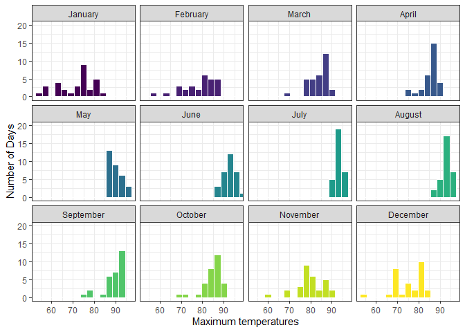
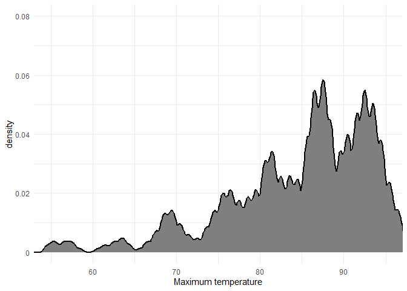
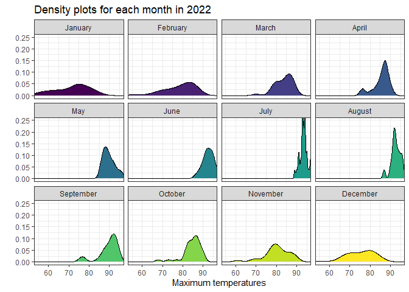
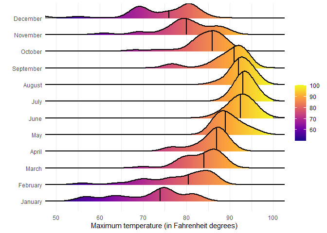
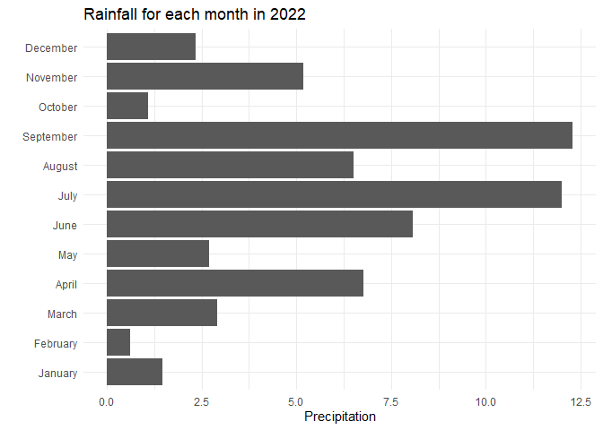
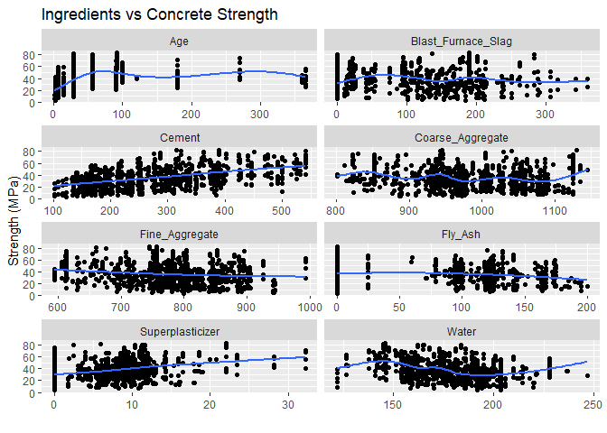
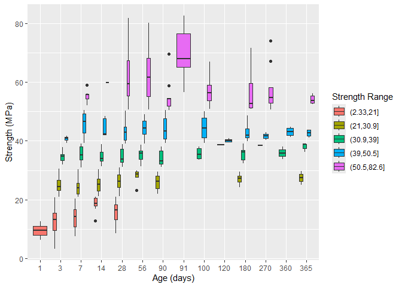
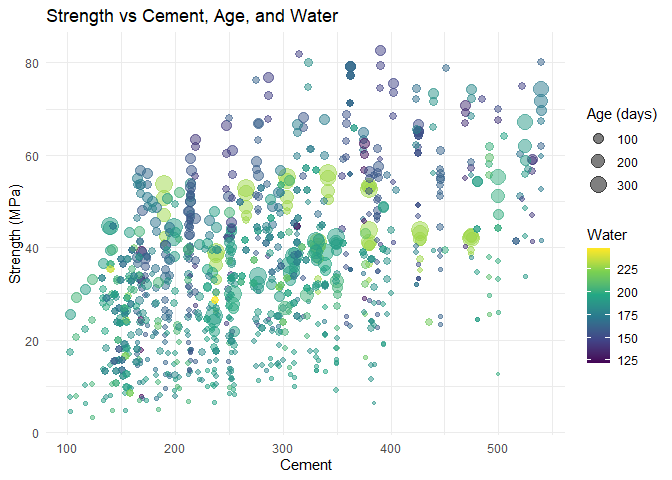

# Data Visualization Project 03


In this exercise you will explore methods to create different types of data visualizations (such as plotting text data, or exploring the distributions of continuous variables).


## PART 1: Density Plots

Using the dataset obtained from FSU's [Florida Climate Center](https://climatecenter.fsu.edu/climate-data-access-tools/downloadable-data), for a station at Tampa International Airport (TPA) for 2022, attempt to recreate the charts shown below which were generated using data from 2016. You can read the 2022 dataset using the code below: 


``` r
library(tidyverse)
weather_tpa_raw <- read_csv("https://raw.githubusercontent.com/aalhamadani/datasets/master/tpa_weather_2022.csv")
# random sample 
sample_n(weather_tpa_raw, 4)
```

```
## # A tibble: 4 × 7
##    year month   day precipitation max_temp min_temp ave_temp
##   <dbl> <dbl> <dbl>         <dbl>    <dbl>    <dbl>    <dbl>
## 1  2022     3     5          0          88       64     76  
## 2  2022     5     4          0          88       73     80.5
## 3  2022     6    28          0.09       95       77     86  
## 4  2022     1    15          0          75       50     62.5
```

See Slides from Week 4 of Visualizing Relationships and Models (slide 10) for a reminder on how to use this type of dataset with the `lubridate` package for dates and times (example included in the slides uses data from 2016).

Using the 2022 data: 

(a) Create a plot like the one below:


Hint: the option `binwidth = 3` was used with the `geom_histogram()` function.


``` r
library(lubridate)
weather_tpa <- weather_tpa_raw |>
  unite("date", year, month, day, sep = "-") |>
  mutate(date = ymd(date),
         month = format(date, "%B"),
         max_temp = as.double(max_temp),
         min_temp = as.double(min_temp),
         precipitation = as.double(precipitation))
weather_tpa$month <- factor(weather_tpa$month, levels = month.name)
```


``` r
ggplot(weather_tpa,
       aes(x = max_temp,
           fill = month)) +
  facet_wrap(vars(month), ncol = 4) +
  geom_histogram(binwidth = 3,
                 color = "white") +
  scale_fill_viridis_d() +
  coord_cartesian(xlim = c(53, 97),
                  ylim = c(0, 20)) +
  theme_bw() +
  guides(fill = FALSE) +
  labs(x = "Maximum temperatures",
       y = "Number of Days")
```

```
## Warning: The `<scale>` argument of `guides()` cannot be `FALSE`. Use "none" instead as
## of ggplot2 3.3.4.
## This warning is displayed once every 8 hours.
## Call `lifecycle::last_lifecycle_warnings()` to see where this warning was
## generated.
```

<!-- -->

(b) Create a plot like the one below:


Hint: check the `kernel` parameter of the `geom_density()` function, and use `bw = 0.5`.


``` r
ggplot(weather_tpa,
       aes(x = max_temp)) +
  geom_density(bw = 0.5,
               kernel = "epanechnikov",
               linewidth = 0.75,
               fill = "gray50") +
  coord_cartesian(xlim = c(55, 95),
                  ylim = c(0, 0.1)) +
  scale_y_continuous(labels = c(0.00, 0.02, 0.04, 0.06, 0.08)) +
  theme_minimal() +
  labs(x = "Maximum temperature")
```

<!-- -->

(c) Create a plot like the one below:


Hint: default options for `geom_density()` were used. 


``` r
ggplot(weather_tpa,
       aes(x = max_temp,
           fill = month)) +
  facet_wrap(vars(month), ncol = 4) +
  geom_density(binwidth = 3) +
  scale_fill_viridis_d() +
  coord_cartesian(xlim = c(55, 95),
                  ylim = c(0, 0.25)) +
  theme_bw() +
  guides(fill = FALSE) +
  labs(title = "Density plots for each month in 2022",
       x = "Maximum temperatures",
       y = "")
```

```
## Warning in geom_density(binwidth = 3): Ignoring unknown parameters: `binwidth`
```

<!-- -->

(d) Generate a plot like the chart below:


Hint: use the`{ggridges}` package, and the `geom_density_ridges()` function paying close attention to the `quantile_lines` and `quantiles` parameters. The plot above uses the `plasma` option (color scale) for the _viridis_ palette.


``` r
library(ggridges)

ggplot(weather_tpa,
       aes(x = max_temp,
           y = month,
           fill = stat(x))) +
  geom_density_ridges_gradient(linewidth = 1,
                               quantile_lines = TRUE,
                               quantiles = 2) +
  scale_fill_viridis_c(name = "",
                       option = "C",
                       breaks = c(60, 70, 80, 90, 100),
                       labels = c(60, 70, 80, 90, 100),
                       limits = c(50, 100)) +
  coord_cartesian(xlim = c(50, 100)) +
  theme_minimal() +
  labs(x = "Maximum temperature (in Fahrenheit degrees)",
       y = "")
```

```
## Warning: `stat(x)` was deprecated in ggplot2 3.4.0.
## ℹ Please use `after_stat(x)` instead.
## This warning is displayed once every 8 hours.
## Call `lifecycle::last_lifecycle_warnings()` to see where this warning was
## generated.
```

```
## Picking joint bandwidth of 1.93
```

<!-- -->

(e) Create a plot of your choice that uses the attribute for precipitation _(values of -99.9 for temperature or -99.99 for precipitation represent missing data)_.


``` r
ggplot(weather_tpa,
       aes(x = precipitation,
           y = month)) +
  geom_col() +
  theme_minimal() +
  labs(title = "Rainfall for each month in 2022",
       x = "Precipitation",
       y = "")
```

<!-- -->

## PART 2: Data on Concrete Strength 

Concrete is the most important material in **civil engineering**. The concrete compressive strength is a highly nonlinear function of _age_ and _ingredients_. The dataset used here is from the [UCI Machine Learning Repository](https://archive.ics.uci.edu/ml/index.php), and it contains 1030 observations with 9 different attributes 9 (8 quantitative input variables, and 1 quantitative output variable). A data dictionary is included below: 


Variable                      |    Notes                
------------------------------|-------------------------------------------
Cement                        | kg in a $m^3$ mixture             
Blast Furnace Slag            | kg in a $m^3$ mixture  
Fly Ash                       | kg in a $m^3$ mixture             
Water                         | kg in a $m^3$ mixture              
Superplasticizer              | kg in a $m^3$ mixture
Coarse Aggregate              | kg in a $m^3$ mixture
Fine Aggregate                | kg in a $m^3$ mixture      
Age                           | in days                                             
Concrete compressive strength | MPa, megapascals


Below we read the `.csv` file using `readr::read_csv()` (the `readr` package is part of the `tidyverse`)


``` r
concrete <- read_csv("../data/concrete.csv", col_types = cols())
```


Let us create a new attribute for visualization purposes, `strength_range`: 


``` r
new_concrete <- concrete |>
  mutate(strength_range =
         cut(Concrete_compressive_strength, 
             breaks = quantile(Concrete_compressive_strength, 
             probs = seq(0, 1, 0.2))) ) |>
  filter(!is.na(strength_range))
```


1. Explore the distribution of 2 of the continuous variables available in the dataset. Do ranges make sense? Comment on your findings.


``` r
concrete_reduced <- pivot_longer(new_concrete,
                                 cols = c(Cement,
                                          Blast_Furnace_Slag,
                                          Fly_Ash,
                                          Water,
                                          Superplasticizer,
                                          Coarse_Aggregate,
                                          Fine_Aggregate,
                                          Age),
                                 names_to = "Category",
                                 values_to = "Value")
```


``` r
ggplot(concrete_reduced,
       aes(x = Value,
           y = Concrete_compressive_strength)) +
  facet_wrap(~ Category,
             scales = "free_x",
             ncol = 2) +
  geom_point() +
  geom_smooth(se = FALSE) +
  labs(title = "Ingredients vs Concrete Strength",
       x = "",
       y = "Strength (MPa)")
```

```
## `geom_smooth()` using method = 'gam' and formula = 'y ~ s(x, bs = "cs")'
```

<!-- -->

Most of the ingredients do not have a strong relation with strength on their own. Ranges may make sense for cement and superplasticizer, which both appear to correlate with increased strength.

2. Use a _temporal_ indicator such as the one available in the variable `Age` (measured in days). Generate a plot similar to the one shown below. Comment on your results.


``` r
ggplot(new_concrete,
       aes(x = factor(Age),
           y = Concrete_compressive_strength,
           fill = strength_range)) +
  geom_boxplot() +
  labs(x = "Age (days)",
       y = "Strength (MPa)",
       fill = "Strength Range")
```

<!-- -->

Under a month of age, the weakest category of mixtures is present and there are almost none in the strong category. Above a month, there are no mixtures within the weakest range and few examples of the second weakest past 90 days.

3. Create a scatterplot similar to the one shown below. Pay special attention to which variables are being mapped to specific aesthetics of the plot. Comment on your results. 


``` r
ggplot(new_concrete,
       aes(x = Cement,
           y = Concrete_compressive_strength,
           size = Age,
           color = Water)) +
  geom_point(alpha = 0.5) +
  scale_color_viridis_c() +
  theme_minimal() +
  labs(title = "Strength vs Cement, Age, and Water",
       y = "Strength (MPa)",
       size = "Age (days)")
```

<!-- -->

Strength increases along with the amount of cement. Weak concrete tends to have a very low age. Mixtures with a high age or water content have an average strength.
